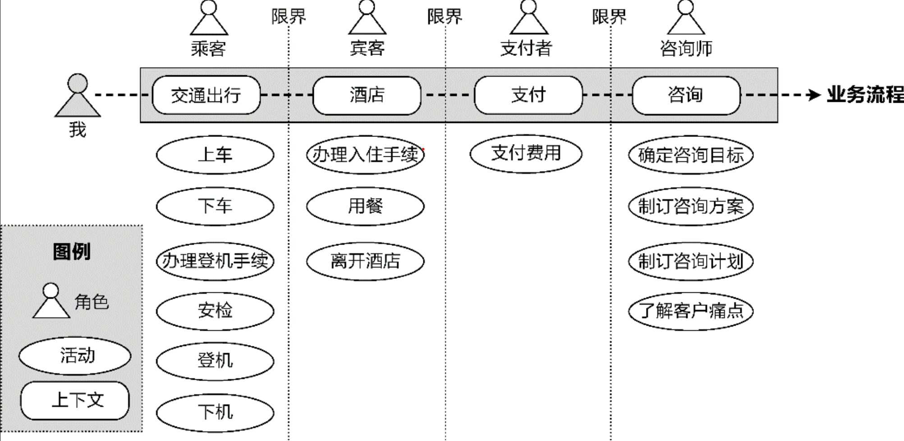
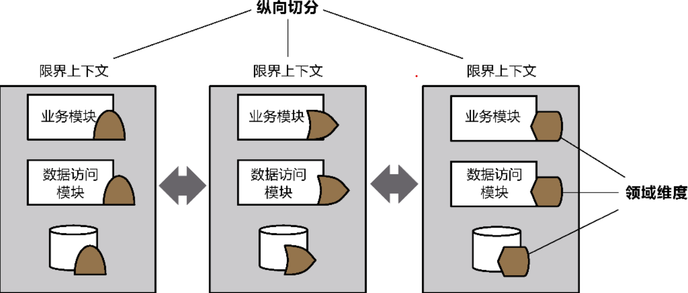

# 限界上下文

## 定义

什么是限界上下文？从上下文来说，随着业务流程的进行不同的活动需要不同的角色参与，并导致上下文因为某个活动的执行发生切换，形成了场景的边界。因而，**_上下文其实是动态的业务流程被边界静态切分的产物。_**
看下作者给的例子。每一个限界上下文都有自己的业务能力，它可以满足上下文角色的各个目标。我理解的是这一条条限界划分出的就是 **_领域知识_** 的边界，里面的每一个块块就是一个领域知识。不同的限界上下文需要不同的领域知识，形成了各自的 **_知识语境_**。各位有异议可以去找其他资料对比，然后请你帮我更正。

## 限界上下文的特征

1. 它是领域模型的知识语境。下面是书中的解释：
   e.g.要保证领域概念的一致性,就需要为那些出现知识冲突的领域概念添加显式的**定语修饰**，如“合同”概念就需要明确细分，分别命名为“销售合同”​“租赁合同”​“培训合同”​“劳务合同”等
2. 它是业务能力的纵向切分。下面是书中的解释：（）
   e.g.先从领域维度进行纵向切分，再从技术维度对限界上下文进行横向切分，因此限界上下文是一个对外暴露业务能力的架构整体。无论是业务架构、应用架构，还是数据架构，都在一个边界中，一旦业务发生变化，只会影响到与该业务相关的限界上下文。（我理解的是先画出这个领域中各个上下文的限界，然后在每个限界上下文中拆分出各个模块）
   

## 限界上下文？系统上下文？有啥区别？

系统上下文指的是整个系统的宏观视图，它描述了系统与其他外部系统或参与者之间的交互。
界限上下文则是一个更微观的概念，它定义了领域模型的应用范围和边界。
所以说两者的视角是不同的。系统上下文，是站在整个大的系统的角度出发考虑的是自己系统和外部其他系统的交互；而界限上下文聚焦于内部，关注的是系统内部的特定领域模型的定义和应用。
