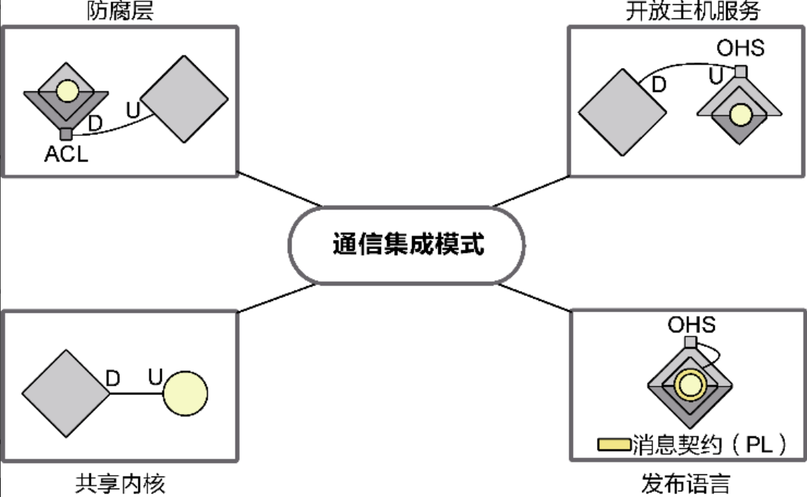
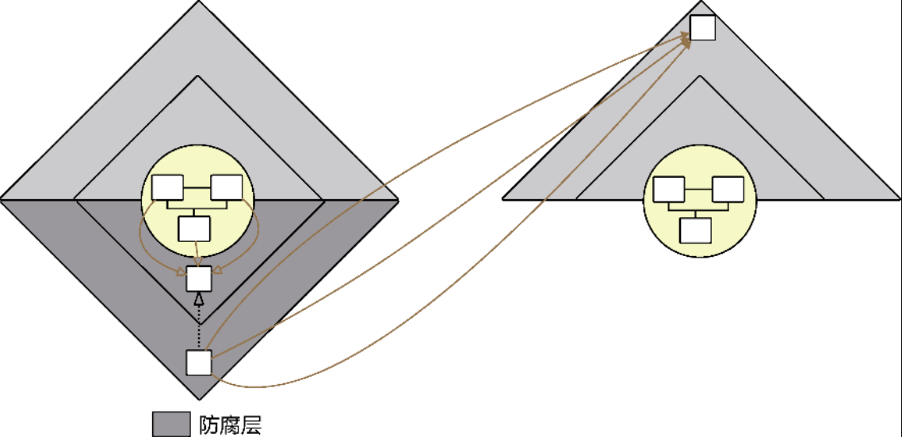

# 上下文映射

## 概述

限界上下文封装了分离业务的能力，上下文映射则建立了限界上下文之间的关系。其目的是**为了让软件模型、团队组织和通信集成之间的协作关系能够清晰呈现，为整个系统的各个领域特性团队提供一个清晰的视图**。这个视图就是上下文映射图。

1. 提供服务的限界上下文成为“上游”，消费（调用）服务的限界上下文称为“下游”。

## 上下文映射模式

其分为以下两种模式。我只把我在项目中用到的通信集成映射模式中的一部分（防腐层）整理了出来，因为我感觉这个设计确实非常好，而且也确实很常用。其他的就给大家分享一个 title，感兴趣的朋友请自行学习。

### 通信集成模式

U 是上游，D 是下游。圆形是领域层。

1. 防腐层
   通过添加防腐层，来方式下游限界上下文领域模型对上游限界上下文领域模型的过多依赖。而且还可以防止上游的变化影响到下游的代码。但如果添加了防腐层后，防腐层的接口不发送变化，下游是不会受到影响的。
   
2. 开放主机服务
3. 发布语言
4. 共享内核

### 团队协作模式

1. 合作者
2. 客户方/供应方
