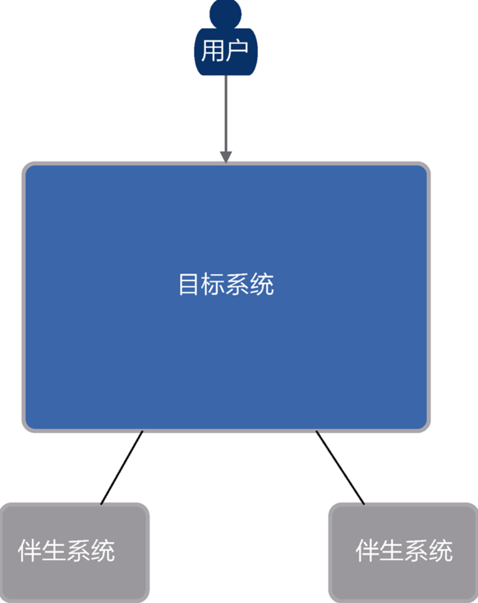
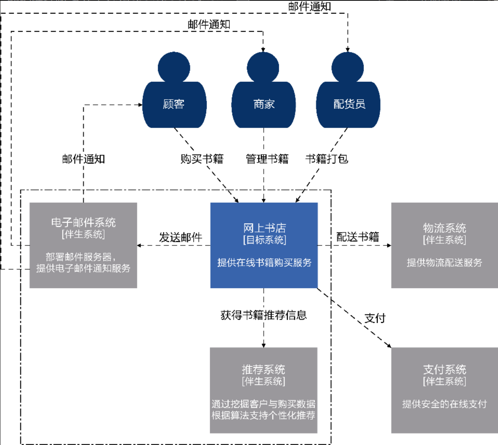
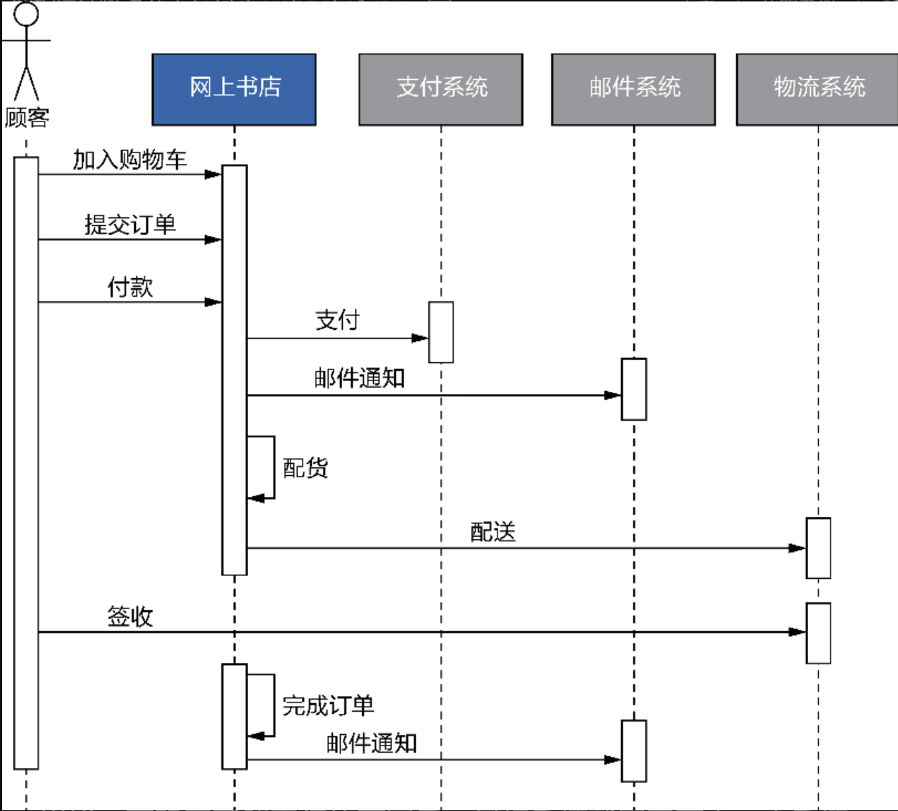

## 系统上下文

### 伴生系统

作者在书中这样定义：“**_那些虽然不是本系统的部件，却对系统的价值体现具有重要意义的对象_**”。就是说它不是你目标系统范围内的但是对于你的目标系统还有很大帮助。
在系统上下文图中大概是这样：

但请注意，伴生系统也分为北向依赖和南向依赖的区分。作者原文：“**_北向依赖意味着伴生系统会调用目标系统的服务，需要考虑目标系统定义了什么样的服务契约。南向依赖意味着目标系统调用伴生系统的服务，需要了解伴生系统定义的接口、调用方式、通信机制，甚至判断当伴生系统出现故障时，目标系统该如何处理。_**”。也就是说北向依赖是伴生系统调用你的目标系统的服务，南向依赖是伴生系统的服务被你目标系统调用。

### 系统上下文的确定

就是说我们要根据利益相关者作为系统上下文的用户，确定出一个系统范围，把一大堆事情分成“系统内”（目标系统）和“系统外”（伴生系统）。例如下面这张图就是作者在书中提供的一个购书系统的**系统上下文图和业务序列图**，请大家带入我上面提到的概念进行深入理解。

系统上下文图和业务序列图的核心的目标都是明确目标系统解空间的范围，也就是**找到目标系统和伴生系统之间的分割线**。
