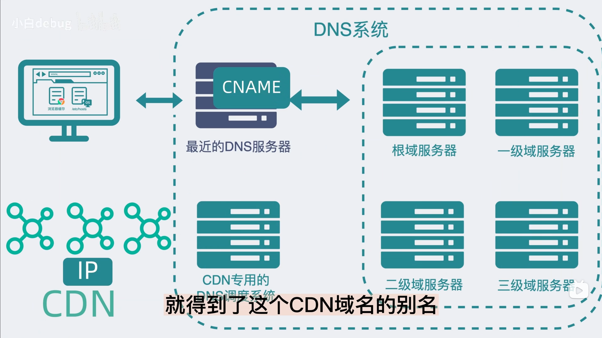

# 你知道什么是 CDN 吗？

## 概念

要讲解 CDN（内容分发网络） 就一定要先知道 OSS。大家肯定都知道图片这种东西肯定是不能存储在数据库的，那应该存储在哪呢？放心云服务厂商都给你提供好专门的对象存储！没错就是**OSS**！CDN 与 OSS 之间的关系就好比是 MySQL 和 Redis 之间的关系。是不是有点迷糊？别急往下看。

## CDN 是如何工作的？

我们通常是通过了一个 url 地址来访问某张图片。那么这个 url 是什么样呢？哎呀肯定是 www.域名/xxx.png 这种，那么这个域名是谁的啊？就是 CDN 的域名喽！那么当我们去在浏览器中输入这个域名会发生什么呢？很简单呀！肯定是返回 CDN 服务器的 IP 地址，但这个过程却不那么简单。

1. 首先电脑会查询浏览器缓存和操作系统缓存如果缓存中没有，就会根据最近的 DNS 服务器查询域名，但这时 DNS 返回的并不是一个 IP 地址，而是 CDN 域名的别名（CNAME）
   
2. 然后 DNS 根据 CDN 专用的 DNS 调度系统去找一个理你**最近**的 CDN 服务器的 ip 交给你。浏览器去访问这个 ip 就可以得到图片了。有没有人想知道多加的这一层的 CDN 专用 DNS 调度系统的作用是什么呢？上面提到了就是：给你一个离你最近的 CDN 服务器的 ip。

## 什么是回源？

1. 就像是在 Redis 没有命中，去请求数据库，然后把数据库中查到的数据缓存到 Redis 中。
2. CDN 本质上就是一层缓存，当你第一次访问 CDN 获取某张图片，如果 CDN 中是没有就会触发回源，到 OSS 中找到这个图片，然后保存到 CDN 中。因为 OSS 是对象存储，所以视频，音频都可以用这套流程进行 CDN 加速。

## 什么时候不需要 CDN

1. 就比如在公司内网中，并且服务请求的图片等文件不会被多次重复调用，就可以不用 CDN。
2. 如果回源比例太高也可不用 CDN 了。

## 如何解决 CDN 中与 OSS 的数据不一致问题？

1. 主动刷新 CDN 缓存
2. 设置合理的缓存策略（合理的 ttl）
3. 使 CDN 与 OSS 联动：可以设置一个事件触发机制，如当 OSS 中的某个文件被更新时，去自动触发 CDN 的刷新。
