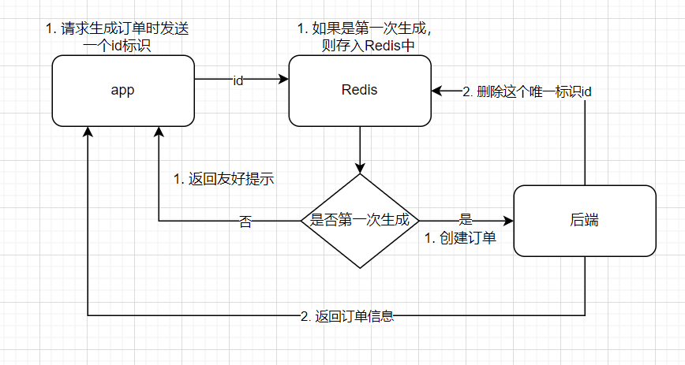

# 什么是幂等性

业务幂等性是说：用户的同一个请求，无论执行多少次，最后得到的结果应该是一致的。比如用户给一个商品下单，无论点击多少次，都应该只生成一个订单。如果不保证幂等性，多次点击后就会生成多个订单，是不是有点像解决并发问题？那我直接加一个分布式锁不就完事了？别急往下看！

## 如何实现幂等性

上图中只做到了基本实现，但是还有两个问题：1.如果在删除 Redis 前，后端服务器挂了怎么办？2.如果有恶意请求攻击怎么办？

1. 对于第一点，很简单。直接给 Redis 的 key-value 加上过期时间（大于生成订单需要的时间）
2. 对于第二点，我们最好要在进入 Redis 前新加一层验证。我么可以使用非对称算法，前端用私钥加密 id 标识和下单的信息，由后端公钥解密，看看是否是 app 发来的还是恶意数据。限流算法

## 幂等问题和并发问题的区别

1. 幂等性：是同一个人发来的请求，而且这些请求只能执行一次，其他的相同请求要放弃处理。
2. 并发问题（锁）：多个人发来的请求，没有获得到锁的等待，获得到锁的继续接着执行处理。
