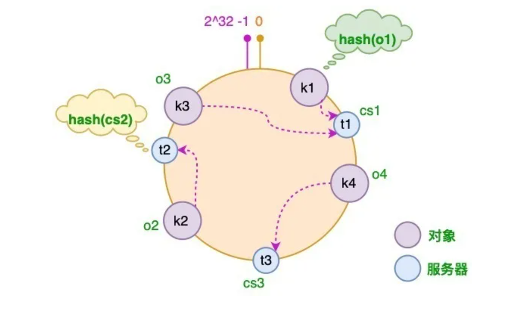
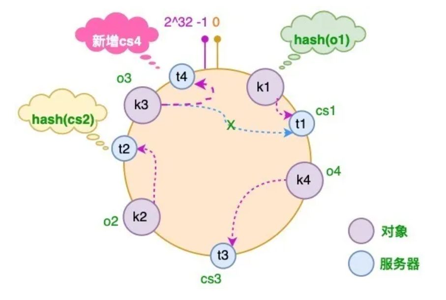
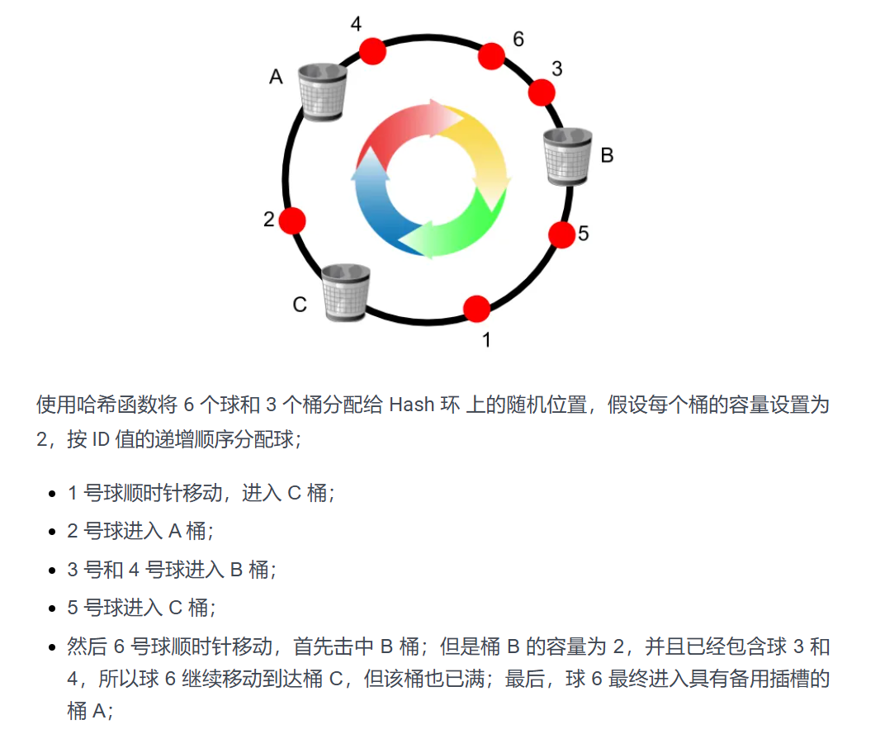

# 一致性 Hash

大家设想一下如果在 Redis Cluster 集群中，如果我们仅仅是根据 key 算出 hash 值然后根据集群中 master 数量取模分配时会有什么问题？

在新增节点和删除节点时，导致原缓存失效！！！因为当你根据 key 去存放到不同的节点时，假设原来是`%3`存的（原有 3 个节点），现在减少了一个节点所以得按照`%2`去找对应的服务器，这样的话原来的 key 就会失效，导致大量缓存 key 过期（雪崩问题）
虽然 Redis Cluster 采用的是哈希槽解决的，但借其引出我们的主题，不过分吧嘿嘿！
所以一致性 Hash 就是防止集群中新增节点和删除节点后所有的数据失效问题。

## 一致性 Hash 原理

1. 使用 Hash 环（2^32 长度）
2. 将服务器 ip 映射到 Hash 环上  
   hash（服务器 ip）% 2^32
3. 将对象 key 映射到 Hash 环上
   hash（key）% 2^32 与上面的不是同一个 Hash 算法
4. 对于每个 key 采用顺时针的方式找到其所属的服务器上
   
5. 如果增加服务器，只需要将一部分 key 重新分配。减少服务器也同理！（按照顺时针分配）
   

## 存在的问题

节点分配不均！！！节点分配不均！！！节点分配不均！！！怎么办？想想为什么不均匀？答：`服务器数量太少`，导致每个服务器管理的范围太宽了。那怎么办？还不能添加服务器，那就给每一个服务器分配多个虚拟节点，然后散布在 Hash 环上，根据 key 先找到虚拟节点，再对应到真是服务器上。并且虚拟节点设置的越多，分配地就越均匀。

## 含边界负载的一致性 Hash

## 声明

本篇文章参考学习于 `https://mp.weixin.qq.com/s/WTz1KA9kOGrqFVTtALJzjQ`如果大家想看看一致性 Hash 算法的代码实现请学习原文。
