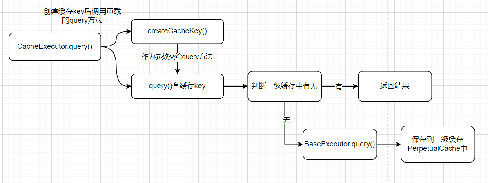

# MyBatis 中的缓存

相信大家对于缓存（如 Redis）肯定时不陌生，使用它就是为了提升系统的性能嘛。而在 MyBatis 中也有关于缓存的配置，那么为啥要有呢？不知道大家在开发过程中有没有遇到这样一个问题，有时候相同的 Sql 语句要执行多次，那么如果每次都去与数据库建立连接的话，是不是太费劲了？因此，MyBatis 就提供了缓存功能，请往下看！

## 一级缓存

一级缓存又称`Session`级别的缓存。你每与数据库建立一次连接都是创建了一个 Session 对象，那么我要是从数据库中查到了一个数据后，我把它缓存到 `Session` 中，而后每次在执行数据库查询操作前，都先来这个`Session`中看看有没有这个数据，如果没有再去访问数据库。你看这是不是就实现了缓存的功能呢？

### 如何代码实现？

1. 下面是一级缓存的实现，其实很好理解，就是要有个地方存放缓存嘛，那么`HashMap`肯定是首选啊，再加一些 CURD 的东西，就成了。

```java
public class PerpetualCache implements Cache {

    private Logger logger = LoggerFactory.getLogger(PerpetualCache.class);

    private String id;

    // 使用HashMap存放一级缓存数据，session 生命周期较短，正常情况下数据不会一直在缓存存放
    // CacheKey -> Object
    private Map<Object, Object> cache = new HashMap<>();

    public PerpetualCache(String id) {
        this.id = id;
    }

    @Override
    public String getId() {
        return id;
    }

    @Override
    public void putObject(Object key, Object value) {
        cache.put(key, value);
    }

    @Override
    public Object getObject(Object key) {
        Object obj = cache.get(key);
        if (obj == null) {
            logger.info("一级缓存 \r\nkey：{} \r\nval：{}", key, JSON.toJSONString(obj));
        }
        return obj;
    }

    @Override
    public Object removeObject(Object key) {
        return cache.remove(key);
    }

    @Override
    public void clear() {
        cache.clear();
    }

    @Override
    public int getSize() {
        return cache.size();
    }
}
```

### PerpetualCache 中的 key 是什么？

了解其中的 HashMap 的 key 也很重要。只有第二用相同的 key 到一级缓存中找才能找到嘛！这也是一级缓存命中问题。下面请看生成 key 的方法。注释中就是生成 key 的关键要素。总结起来就是: **Sql 语句和参数必须相同、MappedStatement 的 id 必须相同、RowBounds 返回的范围得相同，且没有执行`flushCache()`、没有执行 update 方法，而且还得是同一个 Session**。这样才能保证一级缓存命中。

```java
    // BaseExecutor类中的方法
    public CacheKey createCacheKey(MappedStatement ms, Object parameterObject, RowBounds rowBounds, BoundSql boundSql) {
        if (closed) {
            throw new RuntimeException("Executor was closed.");
        }
        CacheKey cacheKey = new CacheKey();
        // com.abc.mybatis.test.dao.IActivityDaoqueryActivityById
        cacheKey.update(ms.getId());
        // RowBounds是用于查询结果分页的，offset就相当于开始位置
        cacheKey.update(rowBounds.getOffset());
        // limit就是限制的查询条数
        cacheKey.update(rowBounds.getLimit());
        // SQL语句
        cacheKey.update(boundSql.getSql());
        // sql查询的参数列表
        List<ParameterMapping> parameterMappings = boundSql.getParameterMappings();
        TypeHandlerRegistry typeHandlerRegistry = ms.getConfiguration().getTypeHandlerRegistry();
        for (ParameterMapping parameterMapping : parameterMappings) {
            Object value;
            String propertyName = parameterMapping.getProperty();
            if (boundSql.hasAdditionalParameter(propertyName)) {
                value = boundSql.getAdditionalParameter(propertyName);
            } else if (parameterObject == null) {
                value = null;
            } else if (typeHandlerRegistry.hasTypeHandler(parameterObject.getClass())) {
                value = parameterObject;
            } else {
                MetaObject metaObject = configuration.newMetaObject(parameterObject);
                value = metaObject.getValue(propertyName);
            }
            cacheKey.update(value);
        }
        if (configuration.getEnvironment() != null) {
            cacheKey.update(configuration.getEnvironment().getId());
        }
        return cacheKey;
    }
```

下面是具体如何生成 key 的方法，猜也能猜到，既然生成一个 key 需要这么多东西，那我们缓存一个 key 就需要很大内存。不如把他取成 Hash 值。下面就是其 Hash 值的计算方法。

```java
public class CacheKey implements Cloneable, Serializable {
    public void update(Object object) {
        if (object != null && object.getClass().isArray()) {
            int length = Array.getLength(object);
            for (int i = 0; i < length; i++) {
                Object element = Array.get(object, i);
                doUpdate(element);
            }
        } else {
            doUpdate(object);
        }
    }

    private void doUpdate(Object object) {
        // 计算Hash值，校验码
        int baseHashCode = object == null ? 1 : object.hashCode();

        count++;
        checksum += baseHashCode;
        baseHashCode *= count;

        hashcode = multiplier * hashcode + baseHashCode;

        updateList.add(object);
    }
}
```

### 如何保存到一级缓存中的呢？

先看图，再看代码


```java
    // DefaultSqlSession类中
    public <E> List<E> selectList(String statement, Object parameter) {
        logger.info("执行查询 statement：{} parameter：{}", statement, JSON.toJSONString(parameter));
        MappedStatement ms = configuration.getMappedStatement(statement);
        try {
            // 调用CacheExecutor中的方法
            return executor.query(ms, parameter, RowBounds.DEFAULT, Executor.NO_RESULT_HANDLER);
        } catch (SQLException e) {
            throw new RuntimeException("Error querying database.  Cause: " + e);
        }
    }

    // CacheExecutor类中
    public <E> List<E> query(MappedStatement ms, Object parameter, RowBounds rowBounds, ResultHandler resultHandler) throws SQLException {
        // 1. 获取绑定SQL
        BoundSql boundSql = ms.getBoundSql(parameter);
        // 2. 创建缓存key
        CacheKey key = createCacheKey(ms, parameter, rowBounds, boundSql);
        // 调用自己的重载方法，由重载方法调用下面BaseExecutor
        return query(ms, parameter, rowBounds, resultHandler, key, boundSql);
    }
    public <E> List<E> query(MappedStatement ms, Object parameter, RowBounds rowBounds, ResultHandler resultHandler, CacheKey key, BoundSql boundSql) throws SQLException {
        Cache cache = ms.getCache();
        if (cache != null) {
            flushCacheIfRequired(ms);
            // 如果开启了二级缓存设置
            if (ms.isUseCache() && resultHandler == null) {
                @SuppressWarnings("unchecked")
                // 先看二级缓存中有无，暂时不用理会
                List<E> list = (List<E>) tcm.getObject(cache, key);
                if (list == null) {
                    list = delegate.<E> query(ms, parameter, rowBounds, resultHandler, key, boundSql);
                    tcm.putObject(cache, key, list);
                }
                return list;
            }
        }
        // 没有开启二级缓存设置，调用BaseExecutor类中的query方法
        return delegate.<E>query(ms, parameter, rowBounds, resultHandler, key, boundSql);
    }

    // BaseExecutor类中
    public <E> List<E> query(MappedStatement ms, Object parameter, RowBounds rowBounds, ResultHandler resultHandler,CacheKey key, BoundSql boundSql)throws SQLException {
        if (closed) {
            throw new RuntimeException("Executor was closed.");
        }
        // 清理局部缓存，查询堆栈为0则清理。queryStack 避免递归调用清理
        if (queryStack == 0 && ms.isFlushCacheRequired()) {
            clearLocalCache();
        }
        List<E> list;
        try {
            queryStack++;
            // 根据cacheKey从localCache中查询数据 一级缓存中有无
            list = resultHandler == null ? (List<E>) localCache.getObject(key) : null;
            if (list == null) {
                // 同时有保存到一级缓存的动作,注意这个
                list = queryFromDatabase(ms, parameter, rowBounds, resultHandler, key, boundSql);
            }
        } finally {
            queryStack--;
        }
        if (queryStack == 0) {
            // 如果是STATEMENT级别，则清理一级缓存
            if (configuration.getLocalCacheScope() == LocalCacheScope.STATEMENT) {
                clearLocalCache();
            }
        }
        return list;
    }
    private <E> List<E> queryFromDatabase(MappedStatement ms, Object parameter, RowBounds rowBounds, ResultHandler resultHandler, CacheKey key, BoundSql boundSql) throws SQLException {
        List<E> list;
        // localCache就是PerpetualCache对象
        // 保存到一级缓存，代表这个查询开始，这是先放个占位符
        localCache.putObject(key, ExecutionPlaceholder.EXECUTION_PLACEHOLDER);
        try {
            list = doQuery(ms, parameter, rowBounds, resultHandler, boundSql);
        } finally {
            // 移除占位符
            localCache.removeObject(key);
        }
        // 数据真正存入一级缓存
        localCache.putObject(key, list);
        return list;
    }
```

## 二级缓存

二级缓存也称为 namespace 级别的缓存，和一级缓存有啥区别的？上面说过一级缓存是 Session 级别的。所以当 Session 最后 commit 时，这个缓存中的东西就都被清除了。

```java
    // BaseExecutor类中
    public void commit(boolean required) throws SQLException {
        if (closed) {
            throw new RuntimeException("Cannot commit, transaction is already closed");
        }
        clearLocalCache();
        if (required) {
            transaction.commit();
        }
    }
```

那么 namespace 级别的缓存是什么意思呢？是因为二级缓存基于 namespace 与一个 Mapper 想对应。它会在整个应用程序的生命周期内存在，其生命周期可以横跨多个 Session。

### 二级缓存的实现

二级缓存中有很多策略可供选择，比如 FIFO、LRU、Soft、Weak。但是我在项目里只实现了 FIFO 的，所以接下来的介绍也是基于 FIFO 策略的。其实二级缓存就是在原来的 PerpetualCache 的基础上进行了一些增强，使用了装饰者模式。

```java
public class FifoCache implements Cache{
    // delegate就是PerpetualCache
    private final Cache delegate;
    // 保存二级缓存
    private Deque<Object> keyList;
    private int size;

    public FifoCache(Cache delegate) {
        this.delegate = delegate;
        this.keyList = new LinkedList<>();
        this.size = 1024;
    }

    @Override
    public void putObject(Object key, Object value) {
        cycleKeyList(key);
        delegate.putObject(key, value);
    }

    @Override
    public Object getObject(Object key) {
        return delegate.getObject(key);
    }

    @Override
    public Object removeObject(Object key) {
        return delegate.removeObject(key);
    }

    @Override
    public void clear() {
        delegate.clear();
        keyList.clear();
    }

    // 在增加记录时判断记录数是否超过size值
    private void cycleKeyList(Object key) {
        keyList.addLast(key);
        if (keyList.size() > size) {
            keyList.removeFirst();
        }
    }
}
```

### 二级缓存是如何创建的？

1. 嘿嘿就是上面代码中不必理会那里。

```java
    // CachingExecutor类中
    public <E> List<E> query(MappedStatement ms, Object parameter, RowBounds rowBounds, ResultHandler resultHandler, CacheKey key, BoundSql boundSql) throws SQLException {
        Cache cache = ms.getCache();
        if (cache != null) {
            flushCacheIfRequired(ms);
            // 如果开启了二级缓存设置
            if (ms.isUseCache() && resultHandler == null) {
                @SuppressWarnings("unchecked")
                // 先看二级缓存中有无
                List<E> list = (List<E>) tcm.getObject(cache, key);
                if (list == null) {
                    list = delegate.<E> query(ms, parameter, rowBounds, resultHandler, key, boundSql);
                    // cache：缓存队列实现类，FIFO
                    // key：哈希值 [mappedStatementId + offset + limit + SQL + queryParams + environment]
                    // list：查询的数据 那tcm是什么？
                    tcm.putObject(cache, key, list);// 保存到暂存区
                }
                return list;
            }
        }
        // 没有开启二级缓存设置
        return delegate.<E>query(ms, parameter, rowBounds, resultHandler, key, boundSql);
    }
```

2. tcm: `TransactionalCacheManager`事务缓存管理器。有啥用呢？最初我学的时候也挺迷糊的，现在我让你非常容易地理解它，一个 Session 对应着一个`TransactionalCacheManager`对象，每个`TransactionalCacheManager`对象管理多个`TransactionalCache`暂存区对象。暂存区对象中也维护了一个`Cache`对象，这个`Cache`就是我们选择的具体二级缓存策略的`Cache`对象。

```java
public class TransactionalCacheManager {
    // TransactionalCache是暂存区
    private Map<Cache, TransactionalCache> transactionalCaches = new HashMap<>();

    public void clear(Cache cache) {
        getTransactionalCache(cache).clear();
    }

    public Object getObject(Cache cache, CacheKey key) {
        return getTransactionalCache(cache).getObject(key);
    }

    public void putObject(Cache cache, CacheKey key, Object value) {
        getTransactionalCache(cache).putObject(key, value);
    }
    /**
     * 提交时全部从暂存区保存到缓存区
     */
    public void commit() {
        for (TransactionalCache txCache : transactionalCaches.values()) {
            txCache.commit();
        }
    }
    /**
     * 回滚时全部回滚
     */
    public void rollback() {
        for (TransactionalCache txCache : transactionalCaches.values()) {
            txCache.rollback();
        }
    }

    private TransactionalCache getTransactionalCache(Cache cache) {
        TransactionalCache txCache = transactionalCaches.get(cache);
        if (txCache == null) {
            txCache = new TransactionalCache(cache);
            transactionalCaches.put(cache, txCache);
        }
        return txCache;
    }
}
// 暂存区
public class TransactionalCache implements Cache {

    private Cache delegate;

    private boolean clearOnCommit;
    // 保存位置
    private Map<Object, Object> entriesToAddOnCommit;
    // 缓存未命中的key
    private Set<Object> entriesMissedInCache;
}
```

3. 注意奥！以上只是保存到了暂存区中，还没有真正保存到二级缓存中。真正的保存时机应该是在这个 Session 提交时！

```java
    // CachingExecutor类中
    public void commit(boolean required) throws SQLException {
        // session commit后才会保存到二级缓存的集合中
        delegate.commit(required);
        tcm.commit();
    }

    // TransactionalCacheManager类中
    // tcm.commit()就是调用的这个
    public void commit() {
        for (TransactionalCache txCache : transactionalCaches.values()) {
            txCache.commit();
        }
    }

    // TransactionalCache 类中
    // txCache.commit()就是这个
    public void commit() {
        if (clearOnCommit) {
            delegate.clear();
        }
        // 提交后把暂存区的数据保存到二级缓存中
        flushPendingEntries();
        reset();
    }

    /**
     * 刷新数据到 MappedStatement#Cache 中，也就是把数据填充到二级缓存中。
     * flushPendingEntries 方法把事务缓存管理器中的数据，填充到 FifoCache 中。
     */
    private void flushPendingEntries() {
        for (Map.Entry<Object, Object> entry : entriesToAddOnCommit.entrySet()) {
            // delegate是FifoCache
            delegate.putObject(entry.getKey(), entry.getValue());
        }
        for (Object entry : entriesMissedInCache) {
            if (!entriesToAddOnCommit.containsKey(entry)) {
                // delegate是FifoCache
                delegate.putObject(entry, null);
            }
        }
    }
```

### 二级缓存保存在哪？

那肯定是一个全局所有人都能拿到的地方喽，而且生命周期要与整个应用一样长的呗。它就是`Configuration`中。其实在使用`XmlMapperBuilder`的时候，会在开启二级缓存的 mapper 中调用`Configuration`的`addCache`方法，把`Cache`对象保存到`Configuration`中。

```java
    /**
     * <cache eviction="FIFO" flushInterval="600000" size="512" readOnly="true"/>
     */
    private void cacheElement(Element context) {
        if (context == null) return;
        // 基础配置信息
        String type = context.attributeValue("type", "PERPETUAL");
        Class<? extends Cache> typeClass = typeAliasRegistry.resolveAlias(type);
        // 缓存队列 FIFO
        String eviction = context.attributeValue("eviction", "FIFO");
        Class<? extends Cache> evictionClass = typeAliasRegistry.resolveAlias(eviction);
        Long flushInterval = Long.valueOf(context.attributeValue("flushInterval"));
        Integer size = Integer.valueOf(context.attributeValue("size"));
        boolean readWrite = !Boolean.parseBoolean(context.attributeValue("readOnly", "false"));
        boolean blocking = !Boolean.parseBoolean(context.attributeValue("blocking", "false"));

        // 解析额外属性信息；<property name="cacheFile" value="/tmp/xxx-cache.tmp"/>
        List<Element> elements = context.elements();
        Properties props = new Properties();
        for (Element element : elements) {
            props.setProperty(element.attributeValue("name"), element.attributeValue("value"));
        }
        // 构建缓存
        builderAssistant.useNewCache(typeClass, evictionClass, flushInterval, size, readWrite, blocking, props);
    }
```

## 总结

以上就是一级缓存，二级缓存的讲解了。比较好玩的就是这里面频繁使用了装饰者模式，就把整个代码搞得看起来乱乱的，但是其实用起来还是很清晰的，扩展性也很强，想要什么二级缓存策略直接自己写一个装饰者就 ok 了。好了就分享这么多喽！
