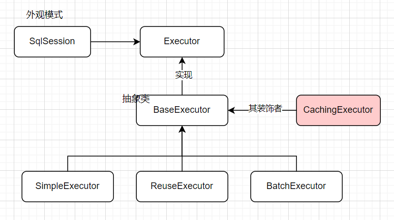
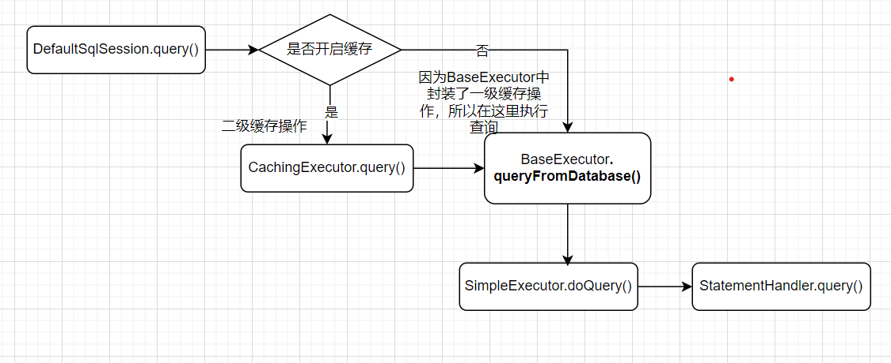

# Executor

MyBatis 中每次想要操作数据库都要建立一个 SqlSession，然后才能进行操作。可为了让类的职责更加清晰、单一。MyBatis 中增加了 Executor 这一模块，其用来执行数据库操作，或是说为操作数据库做准备并对结果进行处理（因为真正的执行 Sql 还是在 StatementHandler 中）。那我们先来了解一些这个 Executor 模块吧，其中的设计模式还是很有意思的。

## 有哪些 Executor 呢

- BaseExecutor 是一个抽象类，里面封装了一级缓存的操作
- SimpleExecutor 是最基础的执行器，没有什么花里胡哨的操作。
- ReuseExecutor 对相同的 Sql 调用重用，免去重建 MappedStatement 的过程。
- BatchExecutor 可以批量执行 Sql。

## 执行流程是什么样的呢

我这里只给大家介绍了 SqlSession 中使用 SimpleExecutor 的流程，其实使用其他的 Executor 实现类也是一样的过程。

- 所以说其实最终是落到了具体的 Executor 实现类上，由其执行`doQuery()`方法
- CacheExecutor 和 BaseExecutor 的设计不得不说真的太巧妙了，把一级缓存和二级缓存完美地衔接在一起!
