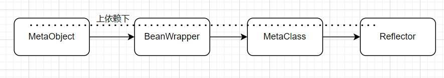

# MyBatis 被查询对象的包装体系

考虑一个问题：如果我们想要把一个对象的属性进行统一的操作（不能直接使用对象实例），比如一起获取值或者一起设置值时应该怎么做？我们应该考虑把对象**解耦**，及把所有的`get方法`、`set方法`和构造方法都拆分出来（反射），然后把这些封装出一个工具类。以后就使用这个工具类来操作对象。
MyBatis 中就是这样做的下面是其结构:


## Reflector

Reflector 反射器,用于解耦对象信息。把一个对象的`get方法`、`set方法`、构造方法都拆分出来，然后保存到 Map 中。下面是详解，我只列出了 get 方法的封装，set 方法也类似。

```java
public class Reflector {

    private static boolean classCacheEnabled = true;
    private static final String[] EMPTY_STRING_ARRAY = new String[0];
    // 线程安全的缓存，缓存已经解析过的类
    private static final Map<Class<?>, Reflector> REFLECTOR_MAP = new ConcurrentHashMap<>();
    // 被解析类的Class对象
    private Class<?> type;
    // get 属性列表 ["name", "age"]
    private String[] readablePropertyNames = EMPTY_STRING_ARRAY;
    // set 属性列表
    private String[] writeablePropertyNames = EMPTY_STRING_ARRAY;
    // set 方法列表 ("name", MethodInvoker)
    private Map<String, Invoker> setMethods = new HashMap<>();
    // get 方法列表
    private Map<String, Invoker> getMethods = new HashMap<>();
    // set 类型列表 ("name", String.class)
    private Map<String, Class<?>> setTypes = new HashMap<>();
    // get 类型列表
    private Map<String, Class<?>> getTypes = new HashMap<>();
    // 构造函数
    private Constructor<?> defaultConstructor;

    // 如何解析类的get方法
    private void addGetMethods(Class<?> clazz) {
        // 存储所有正常的get方法，然后过滤因重载而重复的get
        Map<String, List<Method>> conflictingGetters = new HashMap<>();
        Method[] methods = getClassMethods(clazz);
        for (Method method : methods) {
            String name = method.getName();
            // 根据方法名判断，是不是get方法
            if (name.startsWith("get") && name.length() > 3) {
                // 正常的get方法都是无参的
                if (method.getParameterTypes().length == 0) {
                    // 把方法名转换成属性名：getAge -> age
                    name = PropertyNamer.methodToProperty(name);
                    // 防止出现因为返回值不同的重载get方法
                    addMethodConflict(conflictingGetters, name, method);
                }
            } else if (name.startsWith("is") && name.length() > 2) {
                // 同上
                if (method.getParameterTypes().length == 0) {
                    name = PropertyNamer.methodToProperty(name);
                    addMethodConflict(conflictingGetters, name, method);
                }
            }
        }
        // 解决可能出现的冲突
        resolveGetterConflicts(conflictingGetters);
    }

    private void resolveGetterConflicts(Map<String, List<Method>> conflictingGetters) {
        for (String propName : conflictingGetters.keySet()) { // key:属性名
            List<Method> getters = conflictingGetters.get(propName);
            Iterator<Method> iterator = getters.iterator();
            Method firstMethod = iterator.next();
            // 如果这个属性只有一个get方法
            if (getters.size() == 1) {
                // 直接加入到上面的get方法的Map集合中
                addGetMethod(propName, firstMethod);
            } else {
                // 先拿出来第一个get方法
                Method getter = firstMethod;
                Class<?> getterType = firstMethod.getReturnType();
                while (iterator.hasNext()) {
                    Method method = iterator.next();
                    Class<?> methodType = method.getReturnType();
                    // 如果重载的get方法返回值类型与第一个拿出来的相同，抛出异常
                    if (methodType.equals(getterType)) {
                        throw new RuntimeException("xxxx");
                    // 如果重载的get方法的返回值是我们第一个拿出来的返回值的子类则继续
                    } else if (methodType.isAssignableFrom(getterType)) {
                        // OK getter type is descendant
                    // 如果重载的get方法的返回值是我们第一个拿出来的返回值的父亲类则替换
                    } else if (getterType.isAssignableFrom(methodType)) {
                        getter = method;
                        getterType = methodType;
                    } else {
                        throw new RuntimeException("xxx");
                    }
                }
                // 我们最后添加的get方法的返回值类型一定是个“最父类”
                addGetMethod(propName, getter);
            }
        }
    }
    // 解析这个的各个成员变量的Class对象
    private void addFields(Class<?> clazz) {
        Field[] fields = clazz.getDeclaredFields();
        for (Field field : fields) {
            if (canAccessPrivateMethods()) {
                try {
                    field.setAccessible(true);
                } catch (Exception e) {
                    // Ignored. This is only a final precaution, nothing we can do.
                }
            }
            if (field.isAccessible()) {
                if (!setMethods.containsKey(field.getName())) {
                    int modifiers = field.getModifiers();
                    // 不是常量，不是类变量才可添加入到setTypes
                    if (!(Modifier.isFinal(modifiers) && Modifier.isStatic(modifiers))) {
                        addSetField(field);
                    }
                }
                if (!getMethods.containsKey(field.getName())) {
                    addGetField(field);
                }
            }
        }
        if (clazz.getSuperclass() != null) {
            addFields(clazz.getSuperclass());
        }
    }
    // 只列出get的
    private void addGetField(Field field) {
        if (isValidPropertyName(field.getName())) {
            getMethods.put(field.getName(), new GetFieldInvoker(field));
            getTypes.put(field.getName(), field.getType());
        }
    }
}
```

看完代码后就更加清楚`Reflector`的作用了吧！它就是一个专门用于解耦对象信息，然后封装到 Map 中以便上层使用。

## MetaClass

`MetaClass` 是在 `Reflector` 的一个包装类，同时支持对于复杂成员属性的解析。

```java
public class MetaClass {

    private Reflector reflector;

    private MetaClass(Class<?> type) {
        this.reflector = Reflector.forClass(type);
    }

    // 对于Reflector的getterType方法进行增强，可支持复杂属性
    public Class<?> getGetterType(String name) { // name = 班级[0].学生.成绩
        PropertyTokenizer prop = new PropertyTokenizer(name);
        if (prop.hasNext()) {
            MetaClass metaProp = metaClassForProperty(prop);
            // 最后解析出“成绩”的get方法
            return metaProp.getGetterType(prop.getChildren());
        }
        return getGetterType(prop);
    }

    public String[] getGetterNames() {
        return reflector.getGetablePropertyNames();
    }

    public String[] getSetterNames() {
        return reflector.getSetablePropertyNames();
    }
}
```

## BeanWrapper

`BeanWrapper` 继承于 `BaseWrapper` 这个基类（提供一些通用的解析方法），而`BaseWrapper`又继承于`ObjectWrapper`接口。`ObjectWrapper`就是定义了调用 get\set 的接口和获取 get\set 属性名称和属性类型，以及添加属性的接口。

### ObjectWrapper

```java
public interface ObjectWrapper {

    Object get(PropertyTokenizer prop);

    void set(PropertyTokenizer prop, Object value);

    // 查找属性
    String findProperty(String name, boolean useCamelCaseMapping);

    // 取得getter的名字列表
    String[] getGetterNames();

    // 取得setter的名字列表
    String[] getSetterNames();

    //取得setter的类型
    Class<?> getSetterType(String name);

    // 取得getter的类型
    Class<?> getGetterType(String name);
}
```

### BaseWrapper

主要是其中定义了对于所有集合类操作的方法

```java
public abstract class BaseWrapper implements ObjectWrapper{

    protected static final Object[] NO_ARGUMENTS = new Object[0];
    protected MetaObject metaObject;

    public BaseWrapper(MetaObject metaObject) {
        this.metaObject = metaObject;
    }

    /**
     * 解析集合
     */
    protected Object resolveCollection(PropertyTokenizer prop, Object object) {
        if ("".equals(prop.getName())) {
            return object;
        }else {
            return metaObject.getValue(prop.getName());
        }
    }

    /**
     * 取集合的值
     * 中括号有2个意思，一个是Map，一个是List或数组
     */
    protected Object getCollectionValue(PropertyTokenizer prop, Object collection) {
        if (collection instanceof Map) {
            //map['name']
            return ((Map) collection).get(prop.getIndex());
        } else {
            int i = Integer.parseInt(prop.getIndex());
            if (collection instanceof List) {
                //list[0]
                return ((List) collection).get(i);
            } else if (collection instanceof Object[]) {
                return ((Object[]) collection)[i];
            } else if (collection instanceof char[]) {
                return ((char[]) collection)[i];
            } else if (collection instanceof boolean[]) {
                return ((boolean[]) collection)[i];
            } else if (collection instanceof byte[]) {
                return ((byte[]) collection)[i];
            } else if (collection instanceof double[]) {
                return ((double[]) collection)[i];
            } else if (collection instanceof float[]) {
                return ((float[]) collection)[i];
            } else if (collection instanceof int[]) {
                return ((int[]) collection)[i];
            } else if (collection instanceof long[]) {
                return ((long[]) collection)[i];
            } else if (collection instanceof short[]) {
                return ((short[]) collection)[i];
            } else {
                throw new RuntimeException("The '" + prop.getName() + "' property of " + collection + " is not a List or Array.");
            }
        }
    }
    // 还有一个设置集合的值的方法
}
```

### BeanWrapper

`BeanWrapper` 坐享其成，使用 `BaseWrapper` 和 `MetaClass` 提供的接口就好了

```java
public class BeanWrapper extends BaseWrapper{

    // 原来的对象
    private Object object;
    // 元类
    private MetaClass metaClass;

    public BeanWrapper(MetaObject metaObject, Object object) {
        super(metaObject);
        this.object = object;
        this.metaClass = MetaClass.forClass(object.getClass());
    }

    @Override
    public Object get(PropertyTokenizer prop) {
        // 如果有index(有中括号),说明是集合，那就要解析集合,调用的是 BaseWrapper.resolveCollection 和 getCollectionValue
        if (prop.getIndex() != null) {
            // 有索引代表这是一个集合对象
            Object collection = resolveCollection(prop, object);
            return getCollectionValue(prop, collection);
        } else {
            return getBeanProperty(prop, object);
        }
    }

    private Object getBeanProperty(PropertyTokenizer prop, Object object) {
        try {
            // 得到getter方法，然后调用
            Invoker method = metaClass.getGetInvoker(prop.getName());
            return method.invoke(object, NO_ARGUMENTS);
        } catch (RuntimeException e) {
            throw e;
        } catch (Throwable t) {
            throw new RuntimeException("xxx");
        }
    }
}
```

## MetaClass

在这个包装服务中所有的底层服务已经做好了。`MetaClass`就是将这个服务的最终封装。

```java
public class MetaObject {
    // 原对象
    private Object originalObject;
    // 对象包装器
    private ObjectWrapper objectWrapper;
    // 对象工厂
    private ObjectFactory objectFactory;
    // 对象包装工厂
    private ObjectWrapperFactory objectWrapperFactory;

    private MetaObject(Object object, ObjectFactory objectFactory, ObjectWrapperFactory objectWrapperFactory) {
        this.originalObject = object;
        this.objectFactory = objectFactory;
        this.objectWrapperFactory = objectWrapperFactory;

        if (object instanceof ObjectWrapper) {
            // 如果对象本身已经是ObjectWrapper型，则直接赋给objectWrapper
            this.objectWrapper = (ObjectWrapper) object;
        } else if (objectWrapperFactory.hasWrapperFor(object)) {
            // 如果有包装器,调用ObjectWrapperFactory.getWrapperFor
            this.objectWrapper = objectWrapperFactory.getWrapperFor(this, object);
        } else if (object instanceof Map) {
            // 如果是Map型，返回MapWrapper
            this.objectWrapper = new MapWrapper(this, (Map) object);
        } else if (object instanceof Collection) {
            // 如果是Collection型，返回CollectionWrapper
            this.objectWrapper = new CollectionWrapper(this, (Collection) object);
        } else {
            // 除此以外，返回BeanWrapper
            this.objectWrapper = new BeanWrapper(this, object);
        }
    }

    public static MetaObject forObject(Object object, ObjectFactory objectFactory, ObjectWrapperFactory objectWrapperFactory) {
        if (object == null) {
            // 处理一下null,将null包装起来
            return SystemMetaObject.NULL_META_OBJECT;
        } else {
            return new MetaObject(object, objectFactory, objectWrapperFactory);
        }
    }

    public ObjectFactory getObjectFactory() {
        return objectFactory;
    }

    public ObjectWrapperFactory getObjectWrapperFactory() {
        return objectWrapperFactory;
    }

    public Object getOriginalObject() {
        return originalObject;
    }

    /* --------以下方法都是委派给 ObjectWrapper------ */
    // 查找属性
    public String findProperty(String propName, boolean useCamelCaseMapping) {
        return objectWrapper.findProperty(propName, useCamelCaseMapping);
    }

    // 取得getter的名字列表
    public String[] getGetterNames() {
        return objectWrapper.getGetterNames();
    }

    // 取得setter的名字列表
    public String[] getSetterNames() {
        return objectWrapper.getSetterNames();
    }

    // 取得setter的类型列表
    public Class<?> getSetterType(String name) {
        return objectWrapper.getSetterType(name);
    }

    // 取得getter的类型列表
    public Class<?> getGetterType(String name) {
        return objectWrapper.getGetterType(name);
    }

    //是否有指定的setter
    public boolean hasSetter(String name) {
        return objectWrapper.hasSetter(name);
    }

    // 是否有指定的getter
    public boolean hasGetter(String name) {
        return objectWrapper.hasGetter(name);
    }

    // 取得值
    // 如 班级[0].学生.成绩
    public Object getValue(String name) {
        PropertyTokenizer prop = new PropertyTokenizer(name);
        if (prop.hasNext()) {
            MetaObject metaValue = metaObjectForProperty(prop.getIndexedName());
            if (metaValue == SystemMetaObject.NULL_META_OBJECT) {
                // 如果上层就是null了，那就结束，返回null
                return null;
            } else {
                // 否则继续看下一层(就是 . 后的对象属性)，递归调用getValue
                return metaValue.getValue(prop.getChildren());
            }
        } else {
            return objectWrapper.get(prop);
        }
    }

    // 设置值
    // 如 班级[0].学生.成绩
    public void setValue(String name, Object value) {
        PropertyTokenizer prop = new PropertyTokenizer(name);
        if (prop.hasNext()) {
            MetaObject metaValue = metaObjectForProperty(prop.getIndexedName());
            if (metaValue == SystemMetaObject.NULL_META_OBJECT) {
                if (value == null && prop.getChildren() != null) {
                    // don't instantiate child path if value is null
                    // 如果上层就是 null 了，还得看有没有儿子，没有那就结束
                    return;
                } else {
                    // 否则还得 new 一个，委派给 ObjectWrapper.instantiatePropertyValue
                    metaValue = objectWrapper.instantiatePropertyValue(name, prop, objectFactory);
                }
            }
            // 递归调用setValue
            metaValue.setValue(prop.getChildren(), value);
        } else {
            // 到了最后一层了，所以委派给 ObjectWrapper.set
            objectWrapper.set(prop, value);
        }
    }

    // 为属性生成元对象
    public MetaObject metaObjectForProperty(String name) {
        // 实际是递归调用
        Object value = getValue(name);
        return MetaObject.forObject(value, objectFactory, objectWrapperFactory);
    }

    public ObjectWrapper getObjectWrapper() {
        return objectWrapper;
    }

    // 是否是集合
    public boolean isCollection() {
        return objectWrapper.isCollection();
    }

    // 添加属性
    public void add(Object element) {
        objectWrapper.add(element);
    }

    // 添加属性
    public <E> void addAll(List<E> list) {
        objectWrapper.addAll(list);
    }
}
```
