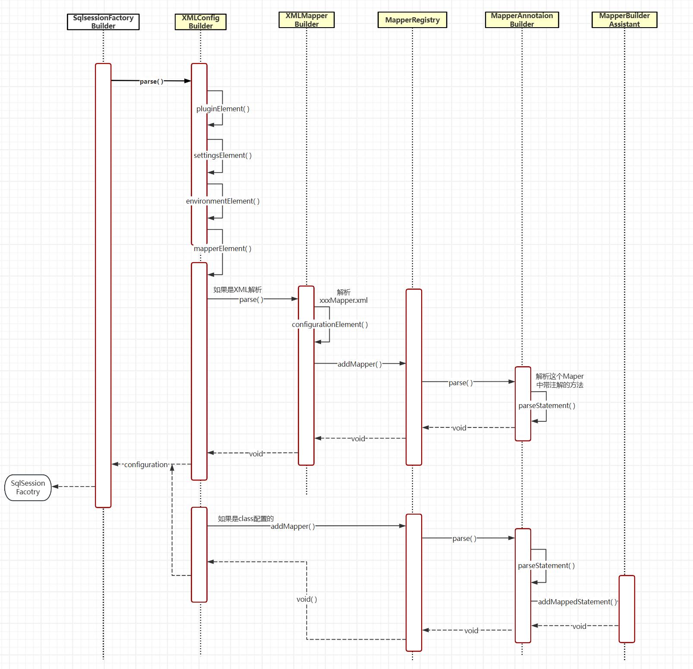

---
# 此页面会在文章列表置顶
# sticky: true
# 此页面会出现在星标文章中
title: 解析 MyBatis 的 XML 配置文件
star: true
order: 2
tag:
  - 源码
category:
  - Java
date: 2024-12-07
timeline: true
---

# 解析 MyBatis 的 XML 配置文件

## **写在前面** 📝

在 MyBatis 官网中的第一部分就是配置，其实就是给你讲了 Configuration 这个类中大概会有哪些属性，然后告诉你在 MyBatis 的配置文件中可以写哪些标签。具体详细的大家可以在中文网阅读 `https://mybatis.net.cn/configuration.html#settings` 在这部分我给大家梳理一下这个配置文件是怎么加载的，也会介绍你写的 xxxMapper.xml 文件是怎么被加载的也就是 &lt;mapper&gt; 标签的加载过程。本篇主要是让大家了解 XML 的加载流程，具体细节我都会在后期补充的。🔍

## **流程图** 📈

下面是其简单的流程(也是生成 SqlSession 的过程)，同时在这之后你的 Configuration 类已经完全加载好了。先提一嘴，如果你 Configuration 类一直活在 MyBatis 的整个生命周期里，他就像一个大管家，一定是单例的。他管理了你所需要的所有配置和所有信息（后续会有详细讲解）。



## XMLConfigBuilder🛠️

一看这名带了“ Builder ”，OK 了是一个建造者模式嘛，为了创建出大管家 Configuration 滴。但他居然还有个爹 BaseBuilder，聪明的小伙伴一会通过名字（Base）知道他爹肯定不止自己这一个儿子哈哈哈 👨‍👩‍👧‍👦。也确实这个 BaseBuilder 是个抽象（爹）类，它主要是为了公用我们的大管家 Configuration 类，同时呢它爹也写好了儿子们会共同调用的方法，避免代码重复。真是太符合课堂上老师讲的抽象类的作用了。

```java

public abstract class BaseBuilder {

    protected final Configuration configuration;
    protected final TypeAliasRegistry typeAliasRegistry;
    protected final TypeHandlerRegistry typeHandlerRegistry;

}

public class XMLConfigBuilder extends BaseBuilder {

    private Element root;

    // 构造函数省略

    /**
     * 解析配置；类型别名、插件、对象工厂、对象包装工厂、设置、环境、类型转换、映射器
     *
     * @return Configuration 创建出大管家
     */
    public Configuration parse() {
        try {
            pluginElement(root.element("plugins"));
            // 设置
            settingsElement(root.element("settings"));
            // 解析环境
            environmentElement(root.element("environments"));
            // 解析映射器
            mapperElement(root.element("mappers"));
        } catch (Exception e) {
            throw new RuntimeException("Error parsing SQL Mapper Configuration. Cause: " + e, e);
        }
        return configuration;
    }
}

```

## mapperElement 方法 📝️

这篇主要这个方法 mapperElement( )。它是用于解析你写的 &lt;mapper&gt; 标签中的内容。这个方法里出现了自己的亲兄弟 XMLMapperBuilder 它也继承了 BaseBuilder。它主要是帮你解析你的 xxxMapper.xml 文件的。多好啊哥俩好啊，单一职责发现没有，哥俩做最好的自己。👬

```java
    private void mapperElement(Element mappers) throws Exception {
        List<Element> mapperList = mappers.elements("mapper");
        for (Element e : mapperList) {
            String resource = e.attributeValue("resource");
            String mapperClass = e.attributeValue("class");
            // XML解析 <mapper resource="mapper/Activity_Mapper.xml"/>
            if (resource != null && mapperClass == null) {
                InputStream inputStream = Resources.getResourceAsStream(resource);
                // 在for循环里每个mapper都重新new一个XMLMapperBuilder，来解析
                XMLMapperBuilder mapperParser = new XMLMapperBuilder(inputStream, configuration, resource);
                mapperParser.parse();
            } else if (resource == null && mapperClass != null) {
                // <mapper class="com.cys.mybatis.test.dao.IUserDao"/>
                Class<?> mapperInterface = Resources.classForName(mapperClass);
                configuration.addMapper(mapperInterface);
            }
        }
    }
```

### **解析 xxxMapper.xml 文件** 📄

下面的 configurationElement( ) 方法就是主要的解析过程了，大家会发现又多了一个没见过的类 MapperBuilderAssistant。Assistant？XMLMapperBuilder 的好帮手？确实是这样的。（开始专业）它提供了许多辅助方法，帮助 XMLMapperBuilder 解析和构建映射器相关的对象，如 ResultMapping、MappedStatement 和 ResultMap 等。这些方法封装了复杂的构建逻辑，使得 XMLMapperBuilder 的代码更加简洁和易读。📚

```java
public class XMLMapperBuilder extends BaseBuilder {

    // 映射器构建助手
    private MapperBuilderAssistant builderAssistant;

    public void parse() throws Exception {
        // 如果当前资源没有加载过再加载，防止重复加载
        if (!configuration.isResourceLoaded(resource)) {
            configurationElement(element);
            // 标记一下，已经加载过了
            configuration.addLoadedResource(resource);
            // 绑定映射器到namespace
            configuration.addMapper(Resources.classForName(builderAssistant.getCurrentNamespace()));
        }
    }
    // <mapper namespace="org.mybatis.example.BlogMapper">
    //   <select id="selectBlog" parameterType="int" resultType="Blog">
    //    select * from Blog where id = #{id}
    //   </select>
    // </mapper>
    private void configurationElement(Element element) {
        // 1.配置namespace
        String namespace = element.attributeValue("namespace");
        if (namespace.equals("")) {
            throw new RuntimeException("Mapper's namespace cannot be empty");
        }
        builderAssistant.setCurrentNamespace(namespace);

        // 2. 配置cache
        cacheElement(element.element("cache"));

        // 3. 解析resultMap
        resultMapElements(element.elements("resultMap"));

        // 4.配置注解select|insert|update|delete
        buildStatementFromContext(element.elements("select"),
                element.elements("insert"),
                element.elements("update"),
                element.elements("delete")
        );
    }
}
```

### **完全通过注解加载一个 Mapper**

其实就是跳过了解析 xxxMapper.xml 这一步，直接根据全限定名去找到这个类，让另一个好兄弟 👬MapperAnnotationBuilder 通过方法上的注解，把这个 Mapper 加载解析到 Configuration 中。

## MapperRegistry

这个类主要是把所有要被代理的 Mapper 对象收集起来，然后让 👬MapperAnnotationBuilder 去解析这个类中带有注解的方法。

```java
// 映射器注册机
public class MapperRegistry {

    private Configuration config;

    public MapperRegistry(Configuration config) {
        this.config = config;
    }

    // 把要添加的映射代理工厂放入map中
    private final Map<Class<?>, MapperProxyFactory<?>> knownMappers = new HashMap<>();

    public <T> void addMapper(Class<T> type) {
        if (type.isInterface()) {
            if (hasMapper(type)) {
                // 如果重复添加了，报错
                throw new RuntimeException("Type " + type + " is already known to the MapperRegistry.");
            }
            // 注册映射器代理工厂
            knownMappers.put(type, new MapperProxyFactory<>(type));

            MapperAnnotationBuilder parser = new MapperAnnotationBuilder(config, type);
            parser.parse();
        }
    }
}
```

## MapperAnnotationBuilder🛠️

别看代码这么多，还有很多没见过的方法。不用担心，它其实就干了俩事。一、解析带有注解的方法。二、把你解析到东西都交给好帮手 MapperBuilderAssistant，让他帮你组装成一个 📜MappedStatement 对象然后放到 Configuration 类中就没了。这个 MappedStatement 也很巧妙，它是把你写的&lt;select/insert/update/delete&gt;标签解析后封装到这个对象里，同时里面还有二级缓存等等配置。后面会再详细补充的~🔍

```java
public class MapperAnnotationBuilder {

    public void parse() {
        String resource = type.toString();
        if (!configuration.isResourceLoaded(resource)) {
            assistant.setCurrentNamespace(type.getName());

            Method[] methods = type.getMethods();
            for (Method method : methods) {
                if (!method.isBridge()) {
                    // 解析语句
                    parseStatement(method);
                }
            }
        }
    }

    private void parseStatement(Method method) {
        Class<?> parameterTypeClass = getParameterType(method);
        LanguageDriver languageDriver = getLanguageDriver(method);
        SqlSource sqlSource = getSqlSourceFromAnnotations(method, parameterTypeClass, languageDriver);

        if (sqlSource != null) {
            final String mappedStatementId = type.getName() + "." + method.getName();
            SqlCommandType sqlCommandType = getSqlCommandType(method);
            KeyGenerator keyGenerator;
            String keyProperty = "id";
            if (SqlCommandType.INSERT.equals(sqlCommandType) || SqlCommandType.UPDATE.equals(sqlCommandType)) {
                keyGenerator = configuration.isUseGeneratedKeys() ? new Jdbc3KeyGenerator() : new NoKeyGenerator();
            } else {
                keyGenerator = new NoKeyGenerator();
            }

            boolean isSelect = sqlCommandType == SqlCommandType.SELECT;
            String resultMapId = null;
            if (isSelect) {
                resultMapId = parseResultMap(method);
            }
            // 调用助手类
            assistant.addMappedStatement(
                    mappedStatementId,
                    sqlSource,
                    sqlCommandType,
                    parameterTypeClass,
                    resultMapId,
                    getReturnType(method),
                    false,
                    false,
                    keyGenerator,
                    keyProperty,
                    languageDriver
            );
        }
    }
}
```

## **总结**

这篇主要是让大家对 MyBatis 解析 XML 的过程有一个初步的了解，也是为了告诉大家其实 MyBatis 的源码并不难，如果你肯自己研究研究后还是很通透的。嗯。。。这篇就这样吧，大家有什么问题欢迎 B 站私信留言~📝️
