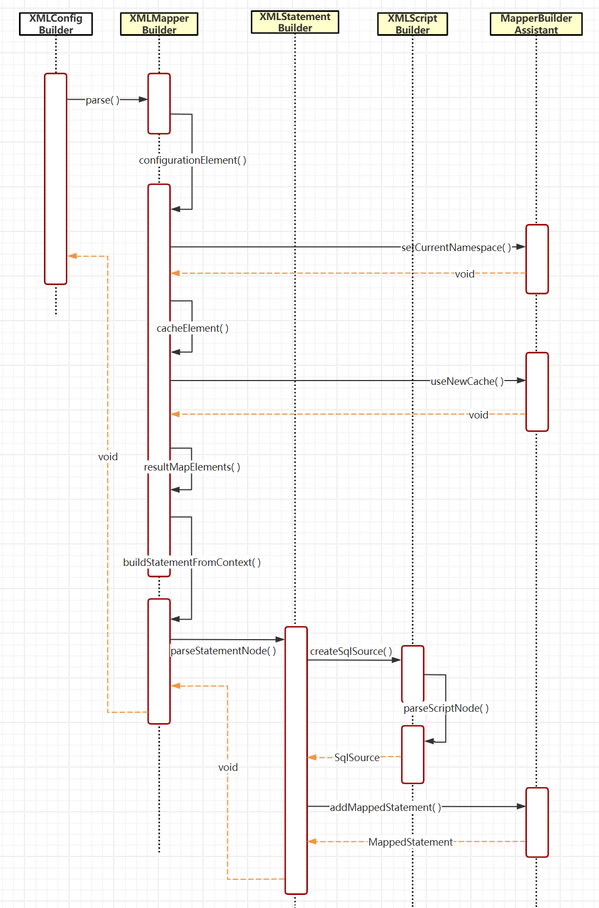
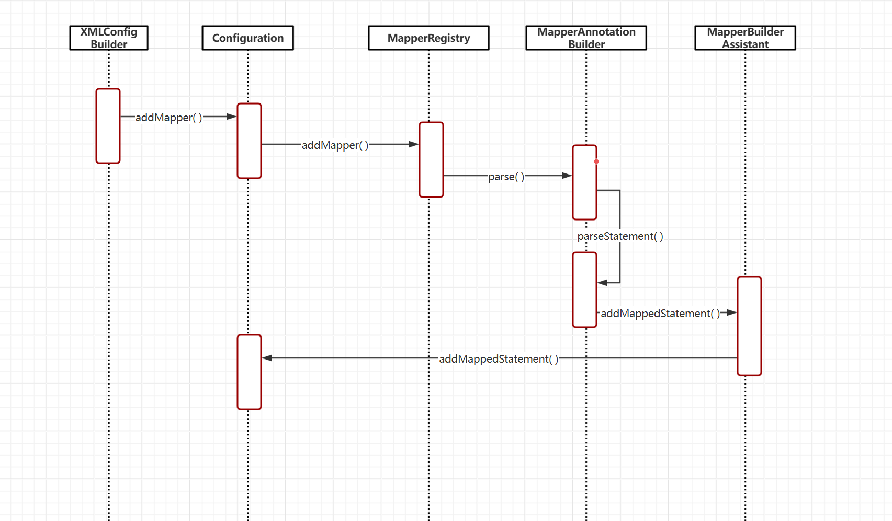

# 解析 Mapper.xml 文件

这篇文章主要讲解上一篇文章中 XMLConfigBuilder 中解析 XML 配置文件时调用的 mapperElement()方法的流程，废话不多说，给兄弟们上图！图中的 parse()方法就是 mapperElement()中调用的，也就是开始节点。

本图是我自己按照书中教程手写的 MyBatis 的流程图，相比源码稍微少了一些配置，但是原理上大抵如此。也请放心，这里的每一个方法的功能与源码都是一一对应的，人家源码的这个方法是上面职责，我写的也是如此。大家以下面这个 xml 文件来进行对照吧

```xml
<?xml version="1.0" encoding="UTF-8"?>
<!DOCTYPE mapper PUBLIC "-//mybatis.org//DTD Mapper 3.0//EN" "http://mybatis.org/dtd/mybatis-3-mapper.dtd">
<mapper namespace="com.abc.mybatis.test.dao.IActivityDao">

    <cache eviction="FIFO" flushInterval="800000" size="256" readOnly="true"/>

    <resultMap id="activityMap" type="com.abc.mybatis.test.po.Activity">
        <id column="id" property="id"/>
        <result column="activity_id" property="activityId"/>
        <result column="activity_name" property="activityName"/>
        <result column="activity_desc" property="activityDesc"/>
        <result column="create_time" property="createTime"/>
        <result column="update_time" property="updateTime"/>
    </resultMap>

    <select id="queryActivityById" parameterType="com.abc.mybatis.test.po.Activity" resultMap="activityMap">
        SELECT activity_id, activity_name, activity_desc, create_time, update_time
        FROM activity
        <trim prefix="where" prefixOverrides="AND | OR" suffixOverrides="and">
            <if test="null != activityId">
                activity_id = #{activityId}
            </if>
        </trim>
    </select>
</mapper>
```

## 真正开始解析

我认为这个方法就是对 mapper.xml 文件真正进行解析。当然真实的源码要解析的比我的更加复杂。但这几个我感觉才是 MyBatis 的重中之重。

```java
private void configurationElement(Element element) {
    // 1.配置namespace
    String namespace = element.attributeValue("namespace");
    if (namespace.equals("")) {
        throw new RuntimeException("Mapper's namespace cannot be empty");
    }
    builderAssistant.setCurrentNamespace(namespace);

    // 2. 配置cache
    cacheElement(element.element("cache"));

    // 3. 解析resultMap
    resultMapElements(element.elements("resultMap"));

    // 4.配置注解select|insert|update|delete
    buildStatementFromContext(element.elements("select"),
            element.elements("insert"),
            element.elements("update"),
            element.elements("delete")
    );
}
```

### cacheElement()方法

那我们先来看第一步，对这个 Mapper 缓存配置的解析。

```java
    /**
     * <cache eviction="FIFO" flushInterval="800000" size="256" readOnly="true"/>
     */
    private void cacheElement(Element context) {
        if (context == null) return;
        // 基础配置信息
        // 缓存队列 FIFO
        // 解析额外属性信息；<property name="cacheFile" value="/tmp/xxx-cache.tmp"/>
        /**
         * 上面这些其实就是在读取你的<cache>标签中的内容，在这里给大家跳过了，
         * 就是一些根据eviction去找标签中的值，很简单。
         */
        // 构建缓存
        // 看看这个哥们多懒（单一职责）自己就负责把数据整出来，然后交给自己好帮手去创建
        // evitionClass就是缓存满了后的回收策略，如FIFO
        builderAssistant.useNewCache(typeClass, evictionClass,
                    flushInterval, size, readWrite, blocking, props);
    }

    // 看看好帮手都干了啥，好像就是创建个Cache对象
    public Cache useNewCache(Class<? extends Cache> typeClass,
                             Class<? extends Cache> evictionClass,
                             Long flushInterval,
                             Integer size,
                             boolean readWrite,
                             boolean blocking,
                             Properties props) {
        // 判断为null，则用默认值
        typeClass = valueOrDefault(typeClass, PerpetualCache.class);
        evictionClass = valueOrDefault(evictionClass, FifoCache.class);

        // 建造者模式构建 二级缓存 Cache [currentNamespace=cn.bugstack.mybatis.test.dao.IActivityDao]
        Cache cache = new CacheBuilder(currentNamespace)
                .implementation(typeClass)
                .addDecorator(evictionClass)
                .clearInterval(flushInterval)
                .size(size)
                .readWrite(readWrite)
                .blocking(blocking)
                .properties(props)
                .build();

        // 添加缓存，ok了专属这个Mapper的缓存配置已经被大管家拿到了
        configuration.addCache(cache);
        currentCache = cache;
        return cache;
    }
```

其实可以看到，解析缓存这里的流程还是很简单的，kukuku 读属性，唰唰唰创建，就完事了。

### resultMapElements() 方法

接下来我们看看 resultMap 这个标签是怎么被解析的：

```java

    /**
     * <resultMap id="activityMap" type="com.abc.mybatis.test.po.Activity">
     *      <id column="id" property="id"/>
     *      <result column="activity_id" property="activityId"/>
     *      <result column="activity_name" property="activityName"/>
     *      <result column="activity_desc" property="activityDesc"/>
     *      <result column="create_time" property="createTime"/>
     *      <result column="update_time" property="updateTime"/>
     * </resultMap>
     */
    private ResultMap resultMapElement(Element resultMapNode, List<ResultMapping> additionalResultMappings) throws Exception {
        // 对着<resultMap>标签看代码，是不是感觉一下子变得很简单了？
        String id = resultMapNode.attributeValue("id");
        String type = resultMapNode.attributeValue("type");
        Class<?> typeClass = resolveClass(type);

        List<ResultMapping> resultMappings = new ArrayList<>();
        resultMappings.addAll(additionalResultMappings);

        List<Element> resultChildren = resultMapNode.elements();
        for (Element resultChild : resultChildren) {
            List<ResultFlag> flags = new ArrayList<>();
            if (resultChild.getName().equals("id")) {
                flags.add(ResultFlag.ID);
            }
            // 构建ResultMapping，看看这个方法都干了啥
            resultMappings.add(buildResultMappingFromContext(resultChild, typeClass, flags));
        }

        // 创建结果映射解析器
        ResultMapResolver resultMapResolver = new ResultMapResolver(builderAssistant, id, typeClass, resultMappings);
        return resultMapResolver.resolve();
    }


    /**
     * <id column="id" property="id"/>
     * <result column="activity_id" property="activityId"/>
     */
    // 说白了这哥们也懒，也是把数据拿出来，然后让好帮手去解析。咦~
    // 但这才是类职责的划分！
    // 我感觉这个好帮手类的设计很有思考价值！无论创建什么都是好帮手干，职责就是创建（苦力）
    private ResultMapping buildResultMappingFromContext(Element context, Class<?> resultType, List<ResultFlag> flags) {
        String property = context.attributeValue("property");
        String column = context.attributeValue("column");
        return builderAssistant.buildResultMapping(resultType, property, column, flags);
    }
```

```java
    // 在ResultMapResolver类（结果映射解析器）中的方法
    public ResultMap resolve() {
        return assistant.addResultMap(this.id, this.type, this.resultMappings);
    }

    // MapperBuilderAssistant 好帮手类中
    // 这小子跟大管家有点熟啊，以后严查
    public ResultMap addResultMap(String id, Class<?> type, List<ResultMapping> resultMappings) {
        // 补全ID全路径，如：com.abc.mybatis.test.dao.IActivityDao + activityMap
        id = applyCurrentNamespace(id, false);

        ResultMap.Builder inlineResultMapBuilder = new ResultMap.Builder(
                configuration,
                id,
                type,
                resultMappings
        );
        ResultMap resultMap = inlineResultMapBuilder.build();
        // 把创建好的ResultMap对象交给大管家
        configuration.addResultMap(resultMap);
        return resultMap;
    }
```

这类咋这么多呢？没事，趁你脑子反应过来了赶紧全告诉都是啥。

1. ResultMapping 就是封装了下面这玩意。

```xml
    /**
     * <result column="activity_id" property="activityId"/>
     */
```

2. ResultMap 就是封装了整个&lt;resultMap&gt;标签（上面有 xml 代码）
3. ResultMapResolver 结果映射解析器：创建 ResultMap 对象实例然后这些 ResultMap 会被用来指导 MyBatis 如何将数据库查询结果映射到 Java 对象

### buildStatementFromContext()方法

终于啊，我们写的 SQL 终于要被解析喽！我们就以&lt;select&gt;标签为例，给大家讲解一下吧。

```java
    // 配置select|insert|update|delete
    private void buildStatementFromContext(List<Element>... lists) {
        for (List<Element> list : lists) {
            for (Element element : list) {
                // XMLStatementBuilder? 那么XMLStatement是什么？
                // 别急，我们往下看这个builder创建了啥出来
                final XMLStatementBuilder statementParser = new XMLStatementBuilder(configuration, builderAssistant, element);
                statementParser.parseStatementNode();
            }
        }
    }
```

总结一下，这个 builder 就是把&lt;select&gt;标签里的属性全都拿出来，然后交给好帮手去创建 MappedStatement 对象，下面给大家说所它吧。

```java
    /**
    <select id="queryActivityById" parameterType="com.abc.mybatis.test.po.Activity" resultMap="activityMap">
        SELECT activity_id, activity_name, activity_desc, create_time, update_time
        FROM activity
        <trim prefix="where" prefixOverrides="AND | OR" suffixOverrides="and">
            <if test="null != activityId">
                activity_id = #{activityId}
            </if>
        </trim>
    </select>
     */
    // XMLStatementBuilder类的方法
    public void parseStatementNode() {
        // 省略一大堆解析<select>标签中的东西，就比如上面的id、parameterType、resultMap等等属性

        // 获取默认语言驱动器
        Class<?> langClass = configuration.getLanguageRegistry().getDefaultDriverClass();
        LanguageDriver langDriver = configuration.getLanguageRegistry().getDriver(langClass);

        // 解析<selectKey>对于自增主键才有用
        processSelectKeyNodes(id, parameterTypeClass, langDriver);
        // 属性标记【仅对 insert 有用】, MyBatis 会通过 getGeneratedKeys 或者通过 insert 语句的 selectKey 子元素设置它的值 step-14 新增
        String keyProperty = element.attributeValue("keyProperty");

        KeyGenerator keyGenerator = null;
        String keyStatementId = id + SelectKeyGenerator.SELECT_KEY_SUFFIX;
        keyStatementId = builderAssistant.applyCurrentNamespace(keyStatementId, true);

        // 解析成SqlSource，DynamicSqlSource/RawSqlSource
        // 它就是封装了所有与 SQL 语句生成相关的信息和逻辑
        // 后面我会单独再写一篇介绍的，动态SQL也很有意思
        SqlSource sqlSource = langDriver.createSqlSource(configuration, element, parameterTypeClass);

        if (configuration.hasGenerator(keyStatementId)) {
            keyGenerator = configuration.getKeyGenerator(keyStatementId);
        } else {
            keyGenerator = configuration.isUseGeneratedKeys() &&  SqlCommandType.INSERT.equals(sqlCommandType) ? new Jdbc3KeyGenerator() : new NoKeyGenerator();
        }

        // 调用助手类，创建出MappedStatement对象，并交给Configuration大管家
        builderAssistant.addMappedStatement(id,
                sqlSource,
                sqlCommandType,
                parameterTypeClass,
                resultMap,
                resultTypeClass,
                flushCache,
                useCache,
                keyGenerator,
                keyProperty,
                langDriver);
    }
```

### MappedStatement 类

MappedStatement 所掌握的信息更加丰富，每一个 MappedStatement 对应一个 Mapper XML 文件中的一个&lt;select&gt;标签，并且它是 CRUD 的核心。

```java
public class MappedStatement {
    // mapper/Activity_Mapper.xml
    private String resource;
    private Configuration configuration;
    // com.abc.mybatis.test.dao.IActivityDao.queryActivityById
    private String id;
    // SELECT(SqlCommandType是个enum类型)
    private SqlCommandType sqlCommandType;
    private SqlSource sqlSource;
    // Activity.class
    Class<?> resultType;
    private LanguageDriver lang;
    // 你写的<resultMap>标签
    private List<ResultMap> resultMaps;
    private boolean flushCacheRequired;
    // 生成自增主键
    private KeyGenerator keyGenerator;
    private String[] keyProperties;
    private String[] keyColumns;
    // 缓存对象，后面会出一篇详细的缓存讲解
    private Cache cache;
    private boolean useCache;
}
```

## 根据 Mapper 方法上的注解加载

主要是用到了 MapperAnnotationBuilder 这个类以及反射，拿到你这个方法中注解的信息，以及方法名等等信息进行创建出 MappedStatement 对象。

下面是主要的创建 MappedStatement 的方法。其实就是获取各种信息，然后全交给好帮手去创建 MappedStatement 对象。

```java
    private void parseStatement(Method method) {
        Class<?> parameterTypeClass = getParameterType(method);
        LanguageDriver languageDriver = getLanguageDriver(method);
        SqlSource sqlSource = getSqlSourceFromAnnotations(method, parameterTypeClass, languageDriver);

        if (sqlSource != null) {
            final String mappedStatementId = type.getName() + "." + method.getName();
            SqlCommandType sqlCommandType = getSqlCommandType(method);
            KeyGenerator keyGenerator;
            String keyProperty = "id";
            if (SqlCommandType.INSERT.equals(sqlCommandType) || SqlCommandType.UPDATE.equals(sqlCommandType)) {
                keyGenerator = configuration.isUseGeneratedKeys() ? new Jdbc3KeyGenerator() : new NoKeyGenerator();
            } else {
                keyGenerator = new NoKeyGenerator();
            }

            boolean isSelect = sqlCommandType == SqlCommandType.SELECT;
            String resultMapId = null;
            if (isSelect) {
                resultMapId = parseResultMap(method);
            }

            // 调用助手类
            assistant.addMappedStatement(
                    mappedStatementId,
                    sqlSource,
                    sqlCommandType,
                    parameterTypeClass,
                    resultMapId,
                    getReturnType(method),
                    false,
                    false,
                    keyGenerator,
                    keyProperty,
                    languageDriver
            );
        }
    }
```
