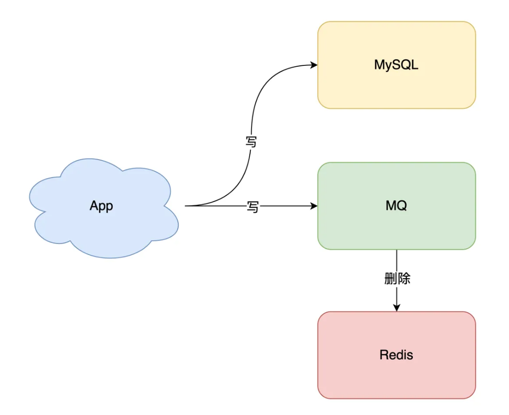
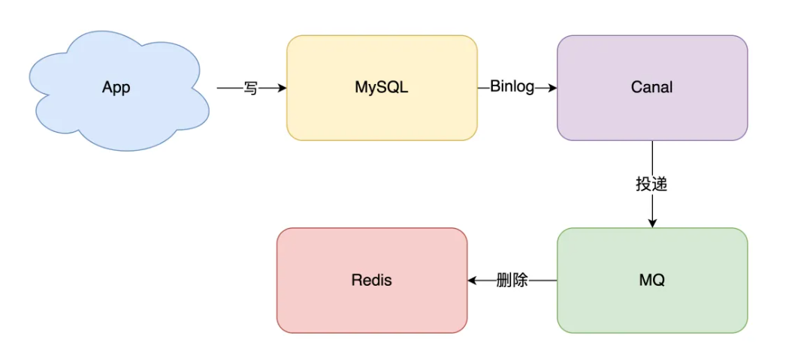

# 缓存与数据库的一致性

这个问题很常见，而且也有一个比较适合的解决方案，但肯定不能保证百分百一致，只是不一致的现象很难发生。不卖关子了，也不说其他方案有什么不好了，我直接给你讲为什么要用这个方案吧。那就是**先更新数据库，后删除缓存**。（本篇学自`水滴与银弹`微信公众号文章）

## 先更新数据库，后删除缓存

1. 出错情况：这种情况可能会出现不一致，但是概率非常低。
   1. 缓存中 A 不存在（数据库中 A = 1）
   2. 线程 1 读取数据库，得到旧值（A = 1）
   3. 线程 2 更新数据库（A = 2）
   4. 线程 2 删除缓存 A
   5. 线程 1 把读到的旧 A 写入缓存
2. 为什么概率低？
   它必须满足以下的条件：
   1. 缓存恰好过期
   2. 读请求和写请求并发执行
   3. 上面线程 2 花费的时间比线程 1 花费的少（线程 2 先于线程 1 执行完）但是一般写入数据库（MySQL）你肯定是要加锁的，表锁或行锁，那么花费的时间通常是比读数据库操作的长。
3. **如何保证更新完数据库后，删除缓存操作一定成功？**
   就是你了 **_重试_** 。但是要考虑好重试次数，如果一直重试会一直占用这个线程资源。那么怎么办才好啊？就是你了 **_异步重试_** ：其实就是把重试请求写到消息队列中，然后由专门的消费者来重试，直到成功。那你又加了一个消息队列，不是让业务更复杂了吗？嗯是这样的，但是消息队列的好处也是大大的，除了上面的功能外，如果执行删除缓存的线程在重试过程中，突然后端服务挂了，那么重试请求也停止了（丢失了）导致数据库和缓存中的数据不一致了，而把这个删除缓存的请求放到消息队列中，等你重启后，还可以继续消费。况且你的项目中一定有别的地方也会用到消息队列，所以就是新增一个“队列”就行了。
   

4. 除了消息队列，现在比较流行的是**订阅数据库变更日志，再操作缓存**。如当 MySQL 修改数据后，会在 Binlog 中记录一条日志，然后通过订阅这个日志，再删除对应的缓存。
   
   这样就不用考虑后端写入消息队列时失败的情况了。

## 介绍延迟双删

1. 在**先删除缓存后更新数据库**时可以使用延时双删：在某个线程删除缓存、更新完数据库之后，先“休眠一会”，再“删除”一次缓存。
2. 在数据库使用了主从架构时，因为在**先更新数据库后删除缓存**的情况下，使用了主从，在修改完主数据库后删完缓存后还没来的及更新从数据库时，有一个新的请求来访问数据（肯定是去从数据库），得到旧值，又写入缓存（旧值），从而·导致数据不一致。该怎么办？
   1. 也是使用延迟双删的思想。当主数据库更新完后，写入消息队列中一条延迟消息（用于删除缓存）时间就设置在差不多从数据库更新完后的大小。
   2. 除了 MQ 还可以使用 DelayQueue，但其会随着 JVM 进程的死亡，丢失更新的风险

## 先删缓存再更新数据库

以下这种情况可能会在上亿流量**高并发**的情况下产生：数据发生了变更，先删除了缓存，然后要去修改数据库，此时还没修改。一个请求过来，去读缓存，发现缓存空了，去查询数据库，查到了修改前的旧数据，放到了缓存中。随后数据变更的程序完成了数据库的修改。完了，数据库和缓存中的数据不一样了...

### 解决方案

在更新数据时，将缓存删除后，将这个更新数据的请求放到一个队列中。在读数据时，如果发现缓存中没有，就也把读数据+更新缓存的命令放到同一个队列中。这里的读数据时可做一点优化，因为多次更新缓存是无意义的，所以加一个判断：如果队列中有一个更新缓存的命令后，就不用将以后的更新缓存命令放到队列中了。
想必大家已经猜到了，每个队列对应一个工作线程，让每个队列中的任务串行执行。这样的话，一个更新数据的请求到达，先去删除缓存然后去更新数据库，但更新还没有完成。而如果这时又来了一个读请求，发现缓存中没有（就要去读数据库并且更新缓存），就把自己放到队列中阻塞等待，知道更新数据库任务结束后开始执行读请求以及更新缓存。

### 方案中的问题

如果修改操作太多的话，简简单单的读请求就会阻塞很长时间。所以读请求命令要在队列中设置一个合适的超时时间，如果超时了就不得不去读数据库。
而且一个队列中也许有多个数据项的更新数据命令，所以可以设置多个队列，每个队列分配不同的任务。

## 总结

其实我也只是个大学生，没经历过多么多么高并发量的开发，以上都是我读大佬的文章总结出自己的解决方案。所以双写一致的解决方案还是要根据你的业务场景来定，在写代码前考虑好自己的业务逻辑，想好其中的难点，根据 QPS 来进行合理的设计。
