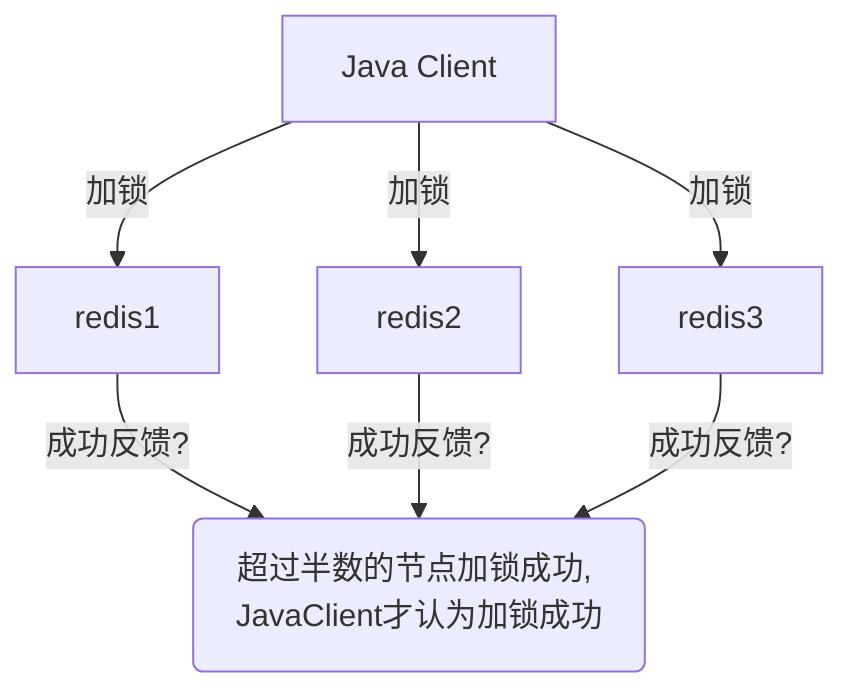
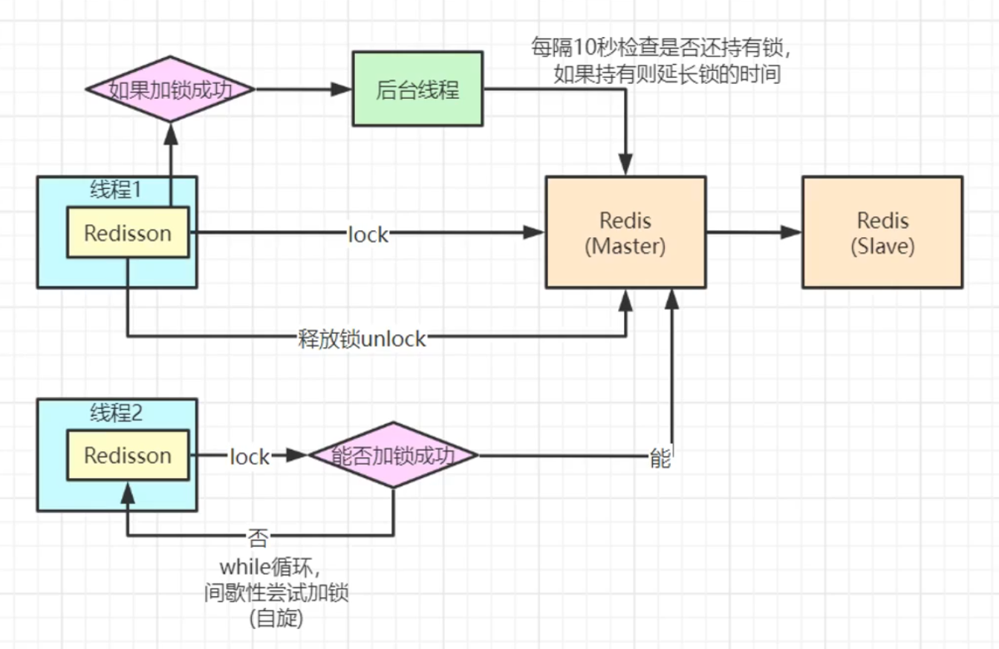

# 分布式锁

**没有最最完美的方案，只有最适合的方案**

## 概述

大家如果学习过 JUC 的话，应该对并发问题有更深刻的了解。对于采用哪种方案来解决并发问题也有自己的理解。但是，JUC 的内容只是帮助你在一个 JVM 中解决共享资源竞争问题，而事实上现在很多项目会用到微服务或分布式部署，那么仅使用 JUC 是无法解决的。上吧！分布式锁就是你了！
我只了解 Redis 的分布式锁，只能给大家介绍 Redis 实现分布式锁相关的内容嘻嘻。Redis 中使用分布式锁的话简单来说就是使用`setnx`（set if not exists）命令。当 key 不存在时，把 value 赋值，而当 key 已经存在则不进行任何操作。所以我们在操作共享资源时候去`setnx`一下，如果返回 true 则可以操作共享资源，如果返回 false 则不能操作共享资源。这样是不是就解决了并发问题呢嘿嘿？非也非也。

## 如何设计分布式锁？

那我们考虑一下如何设计一个分布式锁吧！

1. 分布式锁释放

   1. 比如获取分布式锁后，业务代码出现异常导致无法释放锁怎么办？（使用 try-catch-finally?）
   2. 那如果是执行业务代码时服务器突然挂了（锁来不及释放就挂了）怎么办？（加个过期时间？）

2. 分布式锁删除问题: 如何保证自己加的分布式锁不会被别人删除呢？
   是自己线程本身加的锁才可以删除,可以把自己的线程的 id 添加到分布式锁中。
3. 在业务代码还没有执行完，锁就已经过期了怎么办？
   答案是进行锁续期！设置定时任务，每过一定时间后，检查分布式锁是否还在，然后进行续期
4. 主从架构中，对主节点加锁成功，主节点会去异步同步从节点，而当主节点还没来得及通知从节点自己就挂了。而又有一个新的请求来获取分布式锁了（扣减同一个商品）。这时因为主节点挂了，从节点被选举为新的主节点，而它没来得及同步，所以新的请求也会得到分布式锁。这时候该怎么办？
   1. 我们可以通过`Redlock`机制，使 Java 客户端对多个 Redis 服务端发送加锁命令，当**超过半数**的 Redis 服务端响应加锁成功后，Java 客户端才会认为加锁成功。这时来新的请求加锁，发现无法得到半数以上加锁成功的响应，就认为加锁失败。
   2. 如果使用 RedLock 的话，**三个**Redis 节点就可以做到高可用了，我可以随便挂掉其中的一台机器。那如果部署 5 个 Redis 节点怎样呢？那你就得保证大于 2.5（至少是 3）个节点给你返回加锁成功，这时你就可以随便挂其中两台了（可用性提高了）。那么部署 4 个节点怎么样呢？其实也可以但是就可用性方面比，与 3 个节点没区别，因为 4 个节点要保证大于 2 个（至少是 3）节点返回加锁成功，才可以。这与 3 个 Redis 节点对可用性提高的效果是相同的。



5. Redlock 的坑
   1. 使用了 Redlock 后的主节点不能设置从节点，否则可能会出现与上面相似的问题。假设我们还是使用了 3 个 Redis 服务端：因为 Redis 的主从架构，主节点挂了，从节点会自动成为新的主节点，此时从节点还没来得及同步，主节点就挂了。（原来是两个主节点记录了分布式锁，挂了一个后的从节点没有同步到，只有一个节点记录了分布式锁，所以其他请求还可以获得这个分布式锁）这时来新的请求加锁，发现无法得到半数以上加锁成功的响应，就认为加锁失败。
   2. Redis 如果使用 AOF 来持久化的话，如果参数设置为“每秒更新一次”，也有可能出现问题，因为加分布式锁的命令恰好在那 1 秒内，而这时 Redis 挂了，也会出现其他请求获得到锁的问题。

## Redisson

感觉自己写分布式锁用起来太费劲了？上吧！Redisson 让大家见识一下你的实力吧！Redisson 是 Java 语言实现的分布式锁，它早就帮你把可能出现的问题都给你解决了，只要调用其 api 就可以了。


### Redisson 的锁续期是怎么做到的？

执行定时任务

```java
Timeout task = this.getServiceManager().newTimeout(new TimerTask() {
    public void run(Timeout timeout) throws Exception {
        // 定时任务执行逻辑
    }
    // 定时任务的执行间隔时间，为锁的租约时间的三分之一
}, this.internalLockLeaseTime / 3L, TimeUnit.MILLISECONDS);

```

### 分布式锁性能优化

如何让一个秒杀场景（高并发）的并发度突然提高 10 倍？

1. 分段锁：比如一件商品有 100 个库存，你不选择把 100 个库存放到一个 key 里，而是分成 10 个 key，这样就可以有 10 个请求同时拿到分布式锁。但这样的话后端代码肯定会更加复杂。
