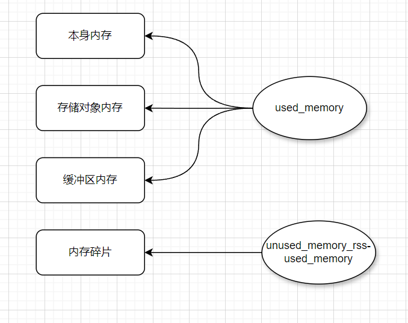

# Redis 在什么情况下会宕机？

之前我一直认为 Redis 宕机肯定就是因为 Redis 的使用内存占用超过了你配置的大小，要不就是什么物理因素，直到我偶然读了一篇微信公众号推文，才打开了新眼界，对 Redis 也有了新的认识。

## Redis 内存都用在哪了？

以下是 Redis 内存总消耗的划分，其中的缓冲区和内存碎片确实让我扩展了眼界

1. Redis 缓冲区

- 输入缓冲区：用于暂存客户端发到 Redis 服务器的命令请求，也就是说客户端的命令首先会被保存在这里。
- 输出缓冲区：用于暂存 Redis 要返回给客户端的数据。
- 复制缓冲区：用于主从复制时，主服务器把写命令先写入复制缓冲区中，然后将这些写命令发送给从服务器。
- AOF 缓冲区：当进行开启 AOF 持久化时，每执行一条会更改 Redis 中数据的命令时，就会先将该命令写入 AOF 缓冲区，然后会调用操作系统的`write`函数，将 AOF 缓冲区的内容写入到系统内核缓冲区中，然后再由持久化方式（ fsync 策略）同步到磁盘。

2. Redis 内存碎片
   这里说的内存碎片和操作系统的内存碎片概念上我认为是一致的。那么如何产生呢？
   1. 内存分配策略
      - 固定内存大小分配：如 Redis 的 jemalloc 内存分配器会按照一系列固定大小分配内存
      - 预分配内存机制：Redis 存储数据的时候向操作系统申请的内存空间可能会大于数据实际需要的存储空间。
   2. 数据的频繁修改和删除
      - 修改数据：将原有的数据修改变小时，会产生碎片
      - 数据删除：当删除一个键值对时，Redis 只是将这个键值对所占用的内存标记为可复用，但这片内存空间可能与其他已分配的内存空间不连续。

## 内存使用率达到 100%等于 Redis 不可用吗？

其实是不一定的，因为如果是 Redis 的存储对象的内存达到了`maxmemory`时，会触发淘汰策略，来保障 Redis 的可用性。但如果是 Redis 的缓冲区占用太多就不一定了，因为可能是 Redis 数据存储区域还没到`maxmemory`，可缓冲区已经占用太多了，导致内存使用率达到 100%，就会导致 Redis 不可用。

## 什么原因导致缓冲区占用太多内存？

1. 输入缓冲区：
   - 客户端命令发送过快且命令体过大
   - 当客户端和 Redis 服务器之间的网络出现波动或者带宽限制时，命令的传输速度会受到影响。比如，客户端在一个网络质量较差的环境下，不断地向 Redis 发送命令，这些命令不能及时被 Redis 接收处理，就会在网络缓存中积压，当网络恢复正常时，大量积压的命令会一下子涌入 Redis 的输入缓冲区，导致内存占用过多。
2. 输出缓冲区：
   - 返回结果集过大：当执行一些范围查询或者获取大量数据的操作时，Redis 会将结果放入输出缓冲区等待发送给客户端。
   - 客户端接收速度过慢

## 本质原因是什么？

导致缓冲区占用太多内存主要应该归因为大 key 问题。我们在设计中要避免大 key，对大 key 做好拆分。
