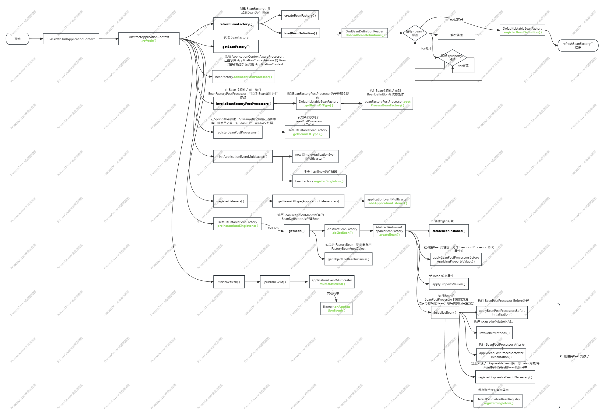
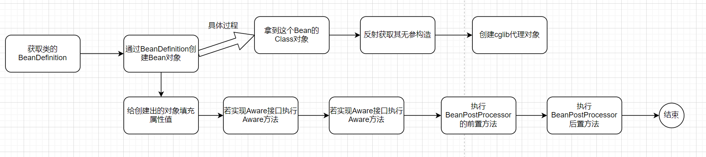

# Bean 的生命周期

## IoC 容器的操作流程

IoC 中最重要的方法是 refresh 方法，其中规范了整个容器的创建流程。其实主要的就那么几步：

1. 加载 BeanDefinition
2. 执行 BeanFactoryPostProcessor 修改 BeanFactory
3. 注册 BeanPostProcessor
4. 创建出一个观察者模式
5. 实例化单例 Bean
6. Bean 创建完成事件广播



## Bean 对象的创建流程



```java
public abstract class AbstractBeanFactory {
    @Override
    public Object getBean(String name) throws BeansException {
        // 真正的操作都是在 doXXX 中实现的
       return doGetBean(name, null);
    }

    protected <T> T doGetBean(final String name, final Object[] args) {
        Object sharedInstance = getSingleton(name);
        if (sharedInstance != null) {
            // 如果是 FactoryBean，则需要调用 FactoryBean#getObject
            return (T) getObjectForBeanInstance(sharedInstance, name);
        }
        // 从BeanFactory中获取目标的BeanDefinition信息
        BeanDefinition beanDefinition = getBeanDefinition(name);
        // 抽象方法 由AbstractAutowireCapableBeanFactory实现
        Object bean = createBean(name, beanDefinition, args);
        return (T) getObjectForBeanInstance(bean, name);
    }
}

public abstract class AbstractAutowireCapableBeanFactory extends AbstractBeanFactory implements AutowireCapableBeanFactory {
    // 注册单例bean
    @Override
    protected Object createBean(String beanName, BeanDefinition beanDefinition, Object[] args) throws BeansException {
        Object bean = null;
        try {
            // 判断是否返回代理对象
            bean = resolveBeforeInstantiation(beanName, beanDefinition);
            if (null != bean) {
                return bean;
            }
            // 实例化bean
            bean = createBeanInstance(beanDefinition, beanName, args);
            // 在设置Bean属性前，允许 BeanPostProcessor 修改属性值
            // 但只能是InstantiationAwareBeanPostProcessor这个接口的
            applyBeanPostProcessorsBeforeApplyingPropertyValues(beanName, bean, beanDefinition);
            // 给 Bean 填充属性
            applyPropertyValues(beanName, bean, beanDefinition);
            // 执行Bean的初始化方法和 BeanPostProcessor 的前置后置方法
            bean = initializeBean(beanName, bean, beanDefinition);
        } catch (Exception e) {
            throw new BeansException("Instantiation of bean failed", e);
        }

        // 注册实现了 DisposableBean 接口的 Bean 对象,将其保存到需要销毁bean的集合中
        registerDisposableBeanIfNecessary(beanName, bean, beanDefinition);

        // DefaultSingletonBeanRegistry.registerSingleton()
        // 单例Bean和多例Bean的区别：是否把其放到内存中，及是否调用 registerSingleton()
        if (beanDefinition.isSingleton()) {
            registerSingleton(beanName, bean);
        }
        return bean;
    }

    protected void applyBeanPostProcessorsBeforeApplyingPropertyValues(String beanName, Object bean, BeanDefinition beanDefinition) {
        for (BeanPostProcessor beanPostProcessor : getBeanPostProcessors()) {
            if (beanPostProcessor instanceof InstantiationAwareBeanPostProcessor) {
                PropertyValues pvs = ((InstantiationAwareBeanPostProcessor) beanPostProcessor).postProcessPropertyValues(beanDefinition.getPropertyValues(), bean, beanName);
                if (null != pvs) {
                    for (PropertyValue propertyValue : pvs.getPropertyValues()) {
                        beanDefinition.getPropertyValues().addPropertyValue(propertyValue);
                    }
                }
            }
        }
    }

    private Object initializeBean(String beanName, Object bean, BeanDefinition beanDefinition) {
        // 如果目标Bean实现了Aware接口，先添加Aware功能
        if (bean instanceof Aware) {
            if (bean instanceof BeanFactoryAware) {
                ((BeanFactoryAware) bean).setBeanFactory(this);
            }
            if (bean instanceof BeanClassLoaderAware) {
                ((BeanClassLoaderAware) bean).setBeanClassLoader(getBeanClassLoader());
            }
            if (bean instanceof BeanNameAware) {
                ((BeanNameAware) bean).setBeanName(beanName);
            }
        }
        // 1. 执行 BeanPostProcessor Before处理
        Object wrappedBean = applyBeanPostProcessorsBeforeInitialization(bean, beanName);
        // 执行 Bean 对象的初始化方法
        try {
            invokeInitMethods(beanName, wrappedBean, beanDefinition);
        } catch (Exception e) {
            throw new BeansException("Invocation of init method of bean[" + beanName + "] failed", e);
        }

        // 2. 执行 BeanPostProcessor After 处理
        // AOP功能在这里添加
        wrappedBean = applyBeanPostProcessorsAfterInitialization(bean, beanName);
        return wrappedBean;
    }

    private void invokeInitMethods(String beanName, Object bean, BeanDefinition beanDefinition) throws Exception {
        // 1. 如果实现接口 InitializingBean
        if (bean instanceof InitializingBean) {
            ((InitializingBean) bean).afterPropertiesSet();
        }
        // 2. 下面的initMethod方法就是xml配置中的 init-method
        String initMethodName = beanDefinition.getInitMethodName();
        if (StrUtil.isNotEmpty(initMethodName) && !(bean instanceof InitializingBean)) {
            Method initMethod = beanDefinition.getBeanClass().getMethod(initMethodName);
            if (null == initMethod) {
                throw new BeansException("Could not find an init method named '" + initMethodName + "' on bean with name '" + beanName + "'");
            }
            initMethod.invoke(bean);
        }
    }
}
```
