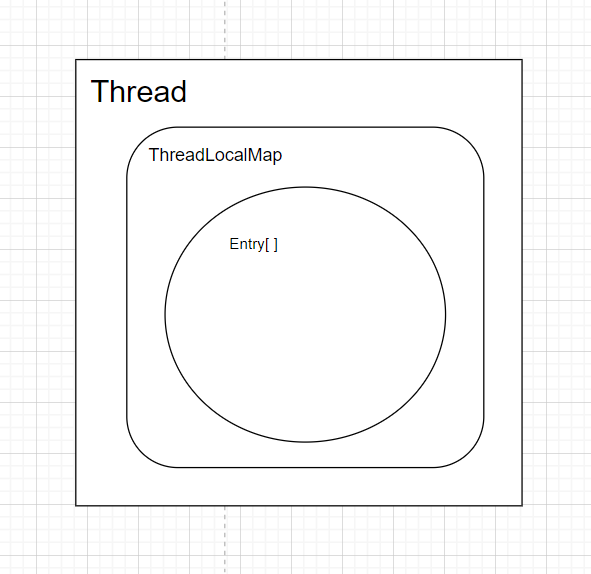

# ThreadLocal 详解

## 基本概念

ThreadLocal 就是用来保存变量的地方，其称为线程本地变量，其中保存的变量的作用域只在某个线程内。从而使线程间数据隔离，保证并发情况下的读写安全。其设计也很巧妙，其中计算元素的 key 时使用了斐波那契散列+类拉链法，让数据分布更均匀，从而减少冲突。

## 核心类

实现 ThreadLocal 这个强大功能其实主要就是用到了 4 个类：

1. Thread：线程，一个 Thread 有一个 ThreadLocalMap
2. ThreadLocal：绑定各个线程对应的数据。多个 ThreadLocal 公用 Thread 中的同·一个 ThreadLocalMap
3. ThreadLocalMap：类似于 HashMap，用于缓存数据的地方

```java
// ThreadLocal的内部类
static class ThreadLocalMap {
    private Entry[] table;
}
```

4. ThreadLocal.ThreadLocalMap.Entry：真正保存 kv 的对象
   

## 主要方法讲解

### ThreadLocal.set()

```java
public class ThreadLocal<T> {
    public void set(T value) {
        Thread t = Thread.currentThread();
        // 就是ThreadLocalMap 中的 table变量
        ThreadLocalMap map = getMap(t);
        if (map != null) {
            map.set(this, value);
        } else {
            createMap(t, value);
        }
    }

    void createMap(Thread t, T firstValue) {
        t.threadLocals = new ThreadLocalMap(this, firstValue);
    }

    ThreadLocalMap(ThreadLocal<?> firstKey, Object firstValue) {
        // 默认设置为16，因为一个Thread可以不止绑定一个ThreadLocal类
        table = new Entry[INITIAL_CAPACITY];
        int i = firstKey.threadLocalHashCode & (INITIAL_CAPACITY - 1);
        // firstKey是当前ThreadLocal对象，firstValue是要保存的值
        table[i] = new Entry(firstKey, firstValue);
        size = 1;
        setThreshold(INITIAL_CAPACITY);
    }
}
```

流程图


### ThreadLocal.get()

```java
public class ThreadLocal<T> {
    public T get() {
        Thread t = Thread.currentThread();
        ThreadLocalMap map = getMap(t);
        if (map != null) {
            ThreadLocalMap.Entry e = map.getEntry(this);
            if (e != null) {
                @SuppressWarnings("unchecked")
                T result = (T)e.value;
                return result;
            }
        }
        // 给其设置null值
        return setInitialValue();
    }

    private T setInitialValue() {
        // 返回个null
        T value = initialValue();
        Thread t = Thread.currentThread();
        ThreadLocalMap map = getMap(t);
        if (map != null) {
            map.set(this, value);
        } else {
            createMap(t, value);
        }
        return value;
    }

    protected T initialValue() {
        return null;
    }
}
```

流程图


## 应用场景

我个人平时开发时，发现总有一些值需要伴随着你的整个线程的生命周期，这些值不一定什么时候就会被需要使用。没错！这时就是 ThreadLocal 的最佳应用场景了。
比如说管理系统中**用户的权限**（这是我在读若依源码时发现的，把用户的权限字段从数据库中读到后保存在 ThreadLocal 中）、**数据库连接池、数据库事务**（比如业务层中多次 CURD 时，为了保证是同一个连接操作时，就可以把这个连接绑定到 ThreadLocal 中）。

## Entry 也很巧妙

下面是 Entry 类的源码。虽然采用了弱引用，但是还是可能会出现内存泄漏。因为`Entry[]`是`ThreadLocalMap`的变量（强引用），`ThreadLocalMap`是`Thread`的成员变量（强引用）。所以如果没有手动地`remove()`，由于`Thread`类可能还在存活（导致 ThreadLocalMap 的强引用存在），就可能会导致 Entry 对象无法被回收。

```java
    // 这里为了防止内存泄漏采用了弱引用
    static class Entry extends WeakReference<ThreadLocal<?>> {
        Object value;

        Entry(ThreadLocal<?> k, Object v) {
            super(k);
            value = v;
        }
    }
```

## 注意事项

1. 记得手动 remove()，不然出现内存泄漏后还得随缘等待出现 Hash 冲突后进行**探测式清理**（比较费时）
2. 持有 ThreadLocal 的类，不建议使用继承。如果继承了，你的儿子也能用，自己也能用然后不知道在什么地方稀里糊涂地使用。可能会导致线程隔离性失效。
3. 多次调用 set() 方法时，后者的值会覆盖前者的值。如果想绑定多个数据，可以多创建几个 ThreadLocal 对象。
4. ThreadLocal 与线程池一起使用的时候，一定要小心再小心。因为线程池的线程是可复用的，如果忘记 remove()的话，很可能读到旧数据。
