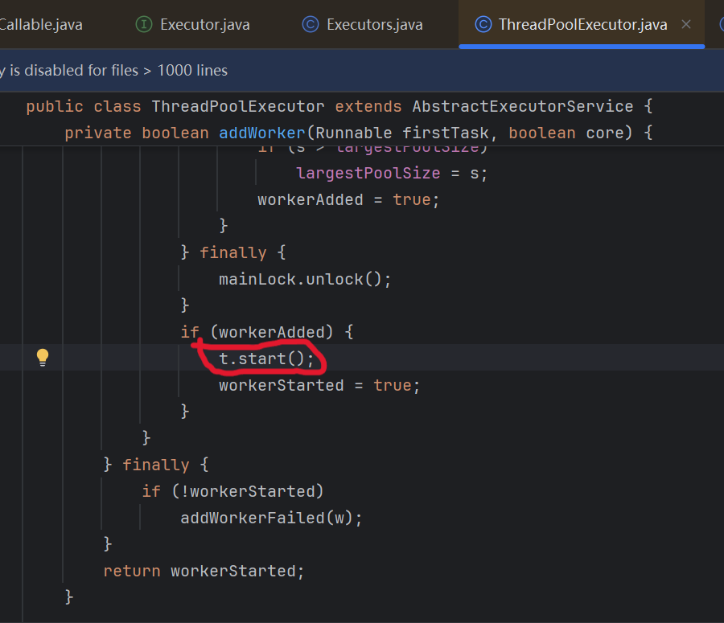

# 这些关于线程的你都知道吗？

## 如何创建一个线程？

也许你会说太简单了，就那 4 个方式：继承 Thread 类、实现 Runnable 接口、实现 Callable 接口和使用线程池，我八股文背的太熟了。哥们那能对吗？我告诉你其实只有**一个方法**：那就是调用`Thread.start()`方法。为什么？

1. 大家如果学习过 JUC 的话很可能会了解这个坑，调用`Thread.run()`方法并不会创建出一个新线程来执行任务，而是在原有的 main 线程上执行。而当你调用`Thread.start()`方法时，就会创建出一个新线程来执行任务。那让我们看看`Thread.start()`方法做了什么叭！

```java
    // 其实主要就是调用了一个`start0()`方法。
    public synchronized void start() {
        // 主要创建线程的代码块
        try {
            start0();
            started = true;
        } finally {
            try {
                if (!started) {
                    group.threadStartFailed(this);
                }
            } catch (Throwable ignore) {
                /* do nothing. If start0 threw a Throwable then
                  it will be passed up the call stack */
            }
        }
    }
    // 而 start0() 是一个本地方法。
    // 用于真正启动一个线程，并开始执行该线程的run()方法
    private native void start0();
```

其实执行完`start0()`方法后，线程状态就从`NEW`变为`RUNNABLE`。而 Thread.run()方法更像是去执行这个任务，它并不是创建线程的方法（个人理解）。

2. 为什么实现 Runnable 接口、实现 Callable 接口都不是创建线程？
   以下是我个人学习理解：
   1. Runnable 和 Callable 本质上都是一个要去执行的任务，只是 Callable 有返回值，Runnable 无返回值。
   2. 你的类实现类上面两个接口是变成了一个任务，最后还不得是作为参数放到`Thread`的构造方法中。所以这也不是在创建线程。
3. 为什么线程池也不是创建 Thread 的方法？
   因为其本质还是调用了 Thread.start()方法。只是对使用者屏蔽了，让你用着更方便。
   图中的 t 是这样定义的：`w = new Worker(firstTask); final Thread t = w.thread;`
   

## Java 的线程和 OS 的线程有什么关系？

1. 有没有听有的人说：Java 线程本质上就是 OS 线程。但我总感觉有点别扭，我认为 Java 线程就像是司机，OS 线程就像是汽车。Java 线程需要借助 OS 线程来在 CPU 上运行。因为当在 Java 程序中创建一个线程并启动它（例如调用 Thread.start()方法），JVM 会请求操作系统创建一个相应的 OS 线程来实际执行这个 Java 线程中的代码。那么 Java 线程和 OS 线程一直都是这种一对一的吗？非也！
2. **JDK21**出现了个新东西，**_虚拟线程_**：它与 OS 线程之间的关系就变成了 n 对 m（n 大于 m）。为了更高效地处理高并发场景。是不是 Java 开发者感觉 Golang 的协程太吊了而发明的？

```java
    public static void main(String[] args) {
        // 使用虚拟线程池
        ExecutorService executor = Executors.newVirtualThreadPerTaskExecutor();
        for (int i = 0; i < 10; i++) {
            int taskId = i;
            executor.submit(() -> {
                System.out.println("任务 " + taskId + " 在虚拟线程中执行");
                try {
                    Thread.sleep(1000);
                } catch (InterruptedException e) {
                    Thread.currentThread().interrupt();
                }
            });
        }
        executor.shutdown();
    }
```
