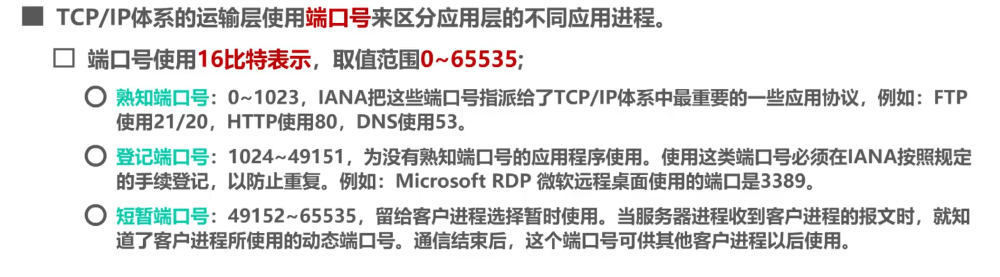
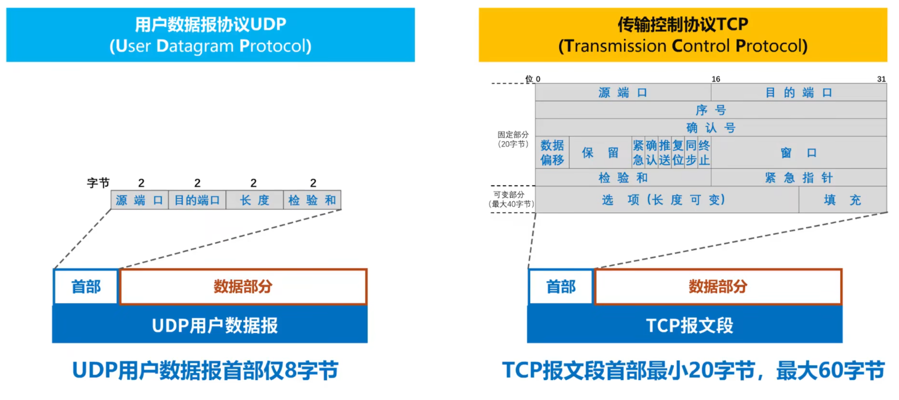
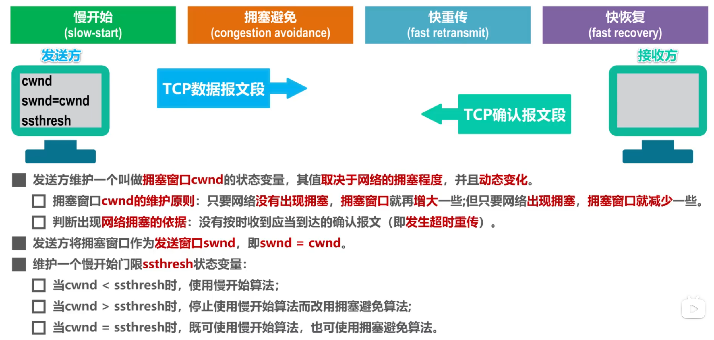
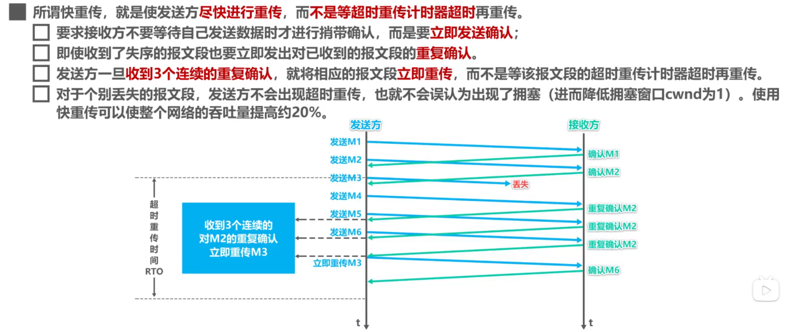
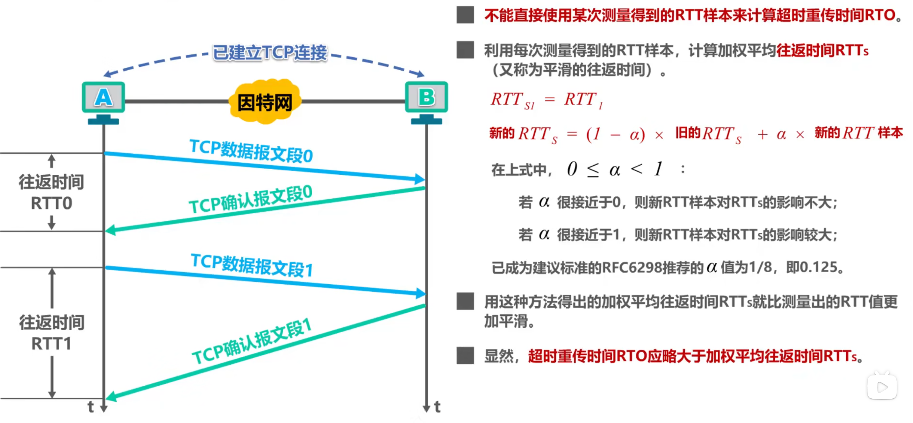

# 传输层

传输层直接为应用进程间的逻辑通信提供服务。因特网的传输层提供了两种不同的传输协议，TCP 和 UDP。

## 端口号

运行在计算机上的进程通过**进程标识符 PID**来标识。而因特网上的计算机并不是统一的操作系统，不同的操作系统使用的 PID 的格式是不同的，所以我们要使用统一的犯法对 TCP/IP 体系的应用进程进行标识 -> **_端口号_**

## TCP 与 UDP 的对比

1. TCP 是需要连接（三次握手）的可靠的，而 UDP 不需要连接，不可靠的。
2. TCP 只能单播发送，而 UDP 可以单播、多播（一对一组）及广播（一对全体）
3. **_UDP 是面向报文的_**：发送方的 UDP 直接将应用层的报文添加一个 UDP 首部，使之成为 UDP 用户数据报，然后发送。接收方直接去掉 UDP 首部，然后把应用层报文交给应用层。**_TCP 是面向字节流的_**：发送方把应用层的数据分段，添加 TCP 首部构建 TCP 报文段，然后发送。接收方把其中的数据载荷部分存储在接收缓存中，并发接收缓存中的字节发送给应用层。
4. 数据报文段首部：
   

## TCP 流量控制

流量控制就是让发送方的发送速率不要太快，要让接收方来得及接收。利用**滑动窗口**机制就可以实现 TCP 连接上发送方的流量控制。滑动窗口就相当于一个可以伸缩的容器，由接收方告诉你这个容器该怎么调整，容器的大小就是你能装的报文段大小。
我这里给一个大致的概念：假如 A 给 B 发送数据，A 把全部的数据分成一个个的报文段，然后逐个发送给 B，当 B 接受到时，要给 A 发送 ACK 确认报文段，这个确认报文段中交包括了将滑动窗口调整为多大。
如果 B 给 A 发送的报文段让 A 把滑动窗口大小调整为 0，那么 A 就会开启一个计时器，如果在计时器超时之前还没有收到 B 的非零窗口通知，A 就会给 B 发送一个零窗口探测报文（防止是因为 B 发给 A 的非零窗口通知丢失），那么为了防止 A 的零窗口探测报文丢失，A 在发送零窗口探测报文的同时，也会再开启一个计时器，为了超时重试。
这个视频讲的流量控制非常好，非常值得去看看`https://www.bilibili.com/video/BV1c4411d7jb?spm_id_from=333.788.player.switch&vd_source=c1eab4b87f2b3fe5c4d10e6062ce5f68&p=60`

## 拥塞控制

在某段时间，若对网络中的某一资源的需求超过了该资源所能提供的可用部分，网络性能就会变差。这个情况就叫拥塞。若出现拥塞而不进行控制，整个网络的吞吐量将会随着输入负荷的增大而下降。

### 拥塞控制的四种算法

1. **慢开始算法**：发送方的拥塞窗口大小（cwnd）以一个报文段为一个单位，当没有达到慢开始门限之前，发送方每收接收方的一个 ACK 都会把自己的拥塞窗口大小乘 2。直到达到了**慢开始门限**（ssthresh），之后采用拥塞避免算法。
2. **拥塞避免算法**：每次收到接收方的 ACK 后只把拥塞窗口的大小加 1。当出现发送的报文段丢失时，必然会导致发送方超时重传，发送发以此判断网络很可能出现拥塞，会进行以下两个操作。首先把 ssthresh 设置为当前出现拥塞时的 cwnd 的一半，然后将 cwnd 减为 1，并重新开始执行慢开始算法（直到 cwnd 达到当前的 ssthresh 为止）。
3. **快重传**：
   
4. **快恢复**：
   发送方收到了 3 个重复确认，就知道了只是丢失了个别的报文段。于是不启动慢开始算法，而是执行快恢复算法。快恢复算法也会把 ssthresh（慢启动门限）和 cwnd 都设置为出现拥塞时的 cwnd（拥塞窗口大小） 的一半，但是也有的快恢复算法把拥塞窗口大小时当前的 ssthresh+3。

## TCP 超时时间的选择

如果出现了重传，就把新的 RTT 值设置为上一个 RTT 的二倍

## TCP 可靠传输的实现

1. 发送方和接收方都有两个窗口：发送窗口和接收窗口。发送方发送的数据会分段，分段后添加 TCP 首部构建 TCP 报文段，然后发送。接收方把其中的数据载荷部分存储在接收缓存中，并发接收缓存中的字节发送给应用层。同时返回确认报文段，让发送方的发送窗口后移，让新的数据进入发送窗口中。

2. 对于不按序到达的数据，接收方会把其临时存放在接收窗口中，等字节流中所缺少的字节收到后，再按序上交给上层的应用进程。
3. 但 TCP 不会为没有携带数据的 ACK 应答报文进行重传，所以在建立连接握手是，由发送 SYN 报文方重传
