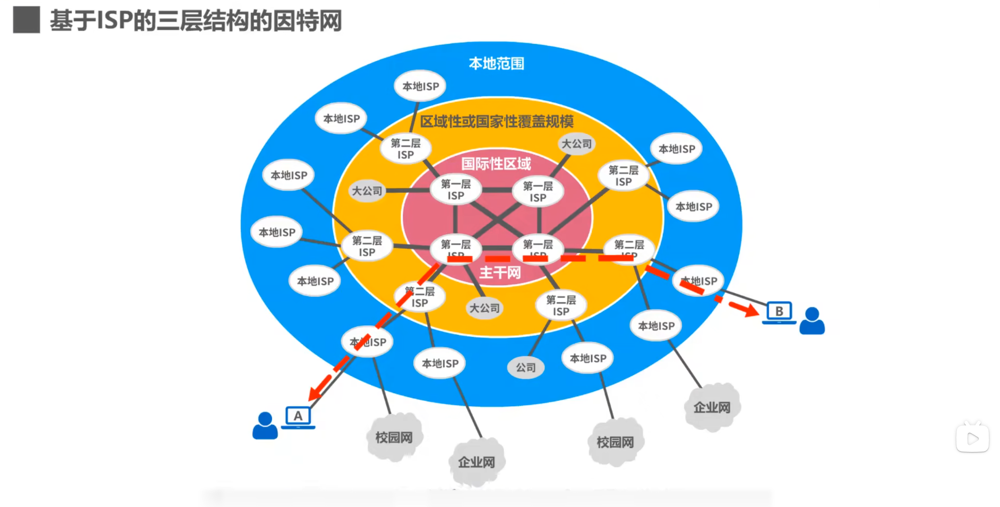
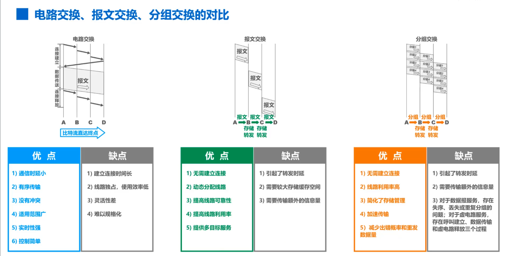

# 因特网概述及前置知识

## 网络、互联网和因特网

1. 网络是由若干个结点和连接这些结点的链路组成。结点可能包括电脑，网络打印机或是交换机。链路可以是有线链路，也可能是无线链路。
2. 多个网络可以通过路由器互连起来，这样就构成了一个覆盖范围更大的网络，即互联网。
3. 因特网是世界上最大的互联网络。

## ISP 因特网服务提供者

普通用户是如何接入到英特网的呢？实际上是通过 ISP 接入因特网的。ISP 可以从英特网管理机构申请到成块的 ip 地址，同时拥有通信线路以及路由器等联网设备，任何机构和个人只要向 ISP 缴纳规定的费用，就可以从 ISP 得到所需要的 IP 地址。

## 因特网的组成

1. **边缘部分**：由所有连接在因特网上的组成。这部分由用户直接使用，用来通信和资源共享。
2. **核心部分**：由大量网络和连接这些网络的路由器组成。这部分是为边缘部分提供服务的（提供连通性和交换）。

## 三种交换方式

电路交换、分组交换、报文交换

1. **电路交换**：
   三个步骤：
   - 建立连接（分配通信资源，这些资源不会被抢占）
   - 通话（一直占用通信资源）
   - 释放连接（归还通信资源）
     虽说电路交换也可以传输计算机数据，但是其线路传输效率太低了。
2. **分组交换**

   1. 把用户要发的数据划分成一个个小段，然后添加一些首部信息，组成一个个分组。分组交换机收到分组后，暂时把他存储下来，再检查其首部，按照首部中的目的地址进行查表转发（也许是转发到下一个交换机）。目标地址收到分组后，去掉其首部，再组成原始数据。
   2. 角色

   - 发送方：构造分组 + 发送分组
   - 路由器：缓存分组 + 转发分组（存储转发）
   - 接受方：接受分组 + 还原报文

3. **报文交换**
   与分组交换类似，但报文交换对报文的大小没有限制。并且报文交换主要用于早期的电报通信网，现在较少使用，通常被较先进的分组交换方式所取代。

