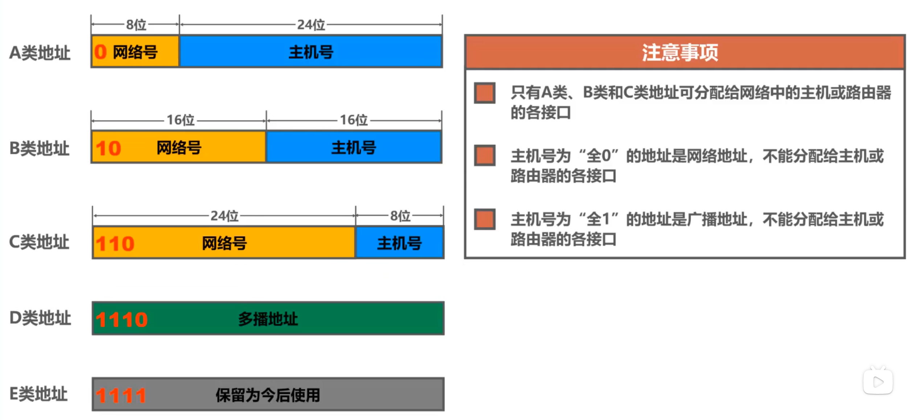
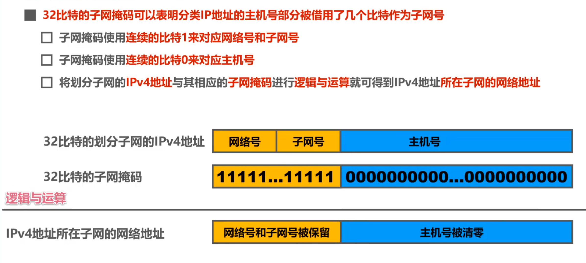
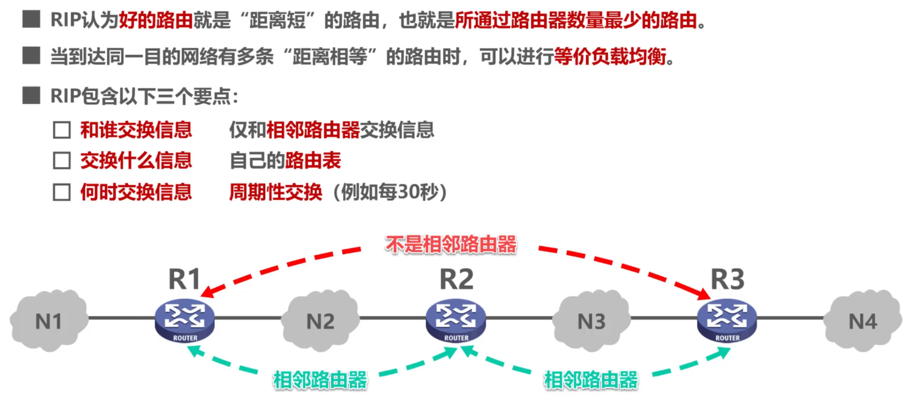
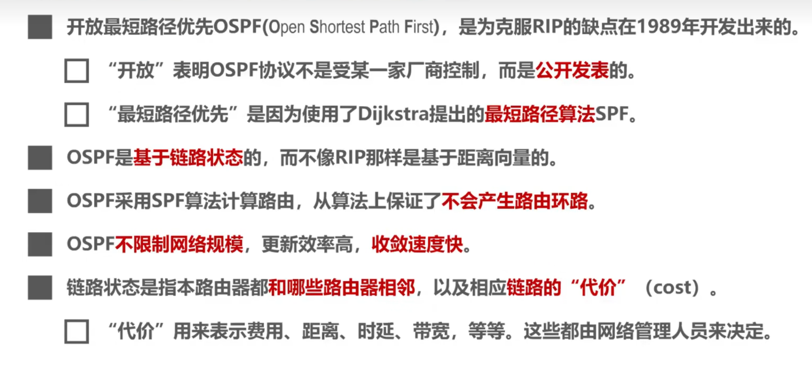
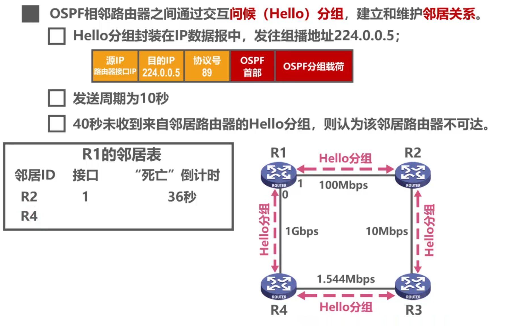
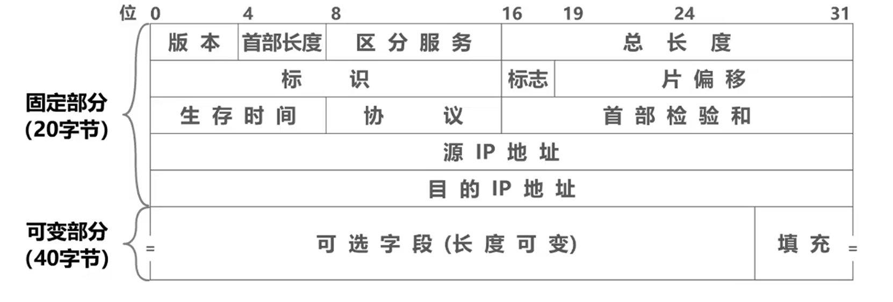

# 网络层

## 概述

主要任务是实现网络互联，进而实现数据包在各个网络之间的传输。

## 虚电路服务，数据报服务

1. 虚电路服务：
   1. 面向连接
   2. 可靠通信由网络来保证
   3. 必须简历网络层连接 -> 虚电路（VC）
   4. 通信双方沿着已建立的虚电路发送分组
   5. 通信结束后，需要释放之前建立的虚电路
2. 数据报服务：（因特网使用）
   1. 无连接
   2. 可靠通信由用户主机保证
   3. 每个分组可走不同的路径
   4. 每个分组的首部必须携带目的主机的完整地址
   5. 但所传输的分组可能有误码、丢失、重复、失序的问题
   6. 因特网采用这种设计思想，所以把复杂的网络处理功能置于因特网的边缘（用户注解和内部的传输层，TCP？）所以在 TCP/IP 体系结构的因特网的网络层提供的是简单灵活的、无连接的、尽最大努力交付的数据报服务。

## IPv4

IPv4 地址就是给因特网上每一台主机（或路由器）的每一个接口分配一个在全世界范围内为一个 32 比特的标识符。

### 分类编址的 IPv4 地址

### 划分子网的 IPv4 地址

就是说无论什么类的网络的子网掩码，都是所有的网络号都是 1，主机号都是 0。所以子网掩码可以用来计算网络地址。比如你向一个 IP 地址发送数据，你肯定是知道对方的 IP 地址吧，然后你用对方的 IP 与你的子网掩码做与运算。如果得到的网络地址与你自己的网络地址不一样，就代表你俩不在同一个网络下。

### 无分类编制的 IPv4 地址

使用 CIDR（斜线计法）即在 IPv4 地址后面加上 “/”，在斜线后面写上网络前缀所占比特位。e.g. 128.14.35.7/20 就代表前 20 位是网络号，后 12 位是主机号。

## 路由选择协议概述

### 静态路由选择

1. 由**_人工配置_**的网络路由、默认路由、特定主机路由、黑洞路由等都属于静态路由。
2. 这种人工配置的方式简单，开销小。但不能及时适应网络状态（流量，拓扑）的变化。
3. 一般只在小规模网络中采用。

### 动态路由选择

1. 路由器通过路由选择协议**_自动获取路由信息_**。
2. 复杂，开销大。但能较好地适应网络状态的变化。
3. 适用于大规模网络。

### 路由信息协议 RIP 的基本工作原理

1. 路由信息协议使用“跳数”作为度量来衡量到达网络的距离。
   1. 路由器到直连网络的距离定义为 1。
   2. 路由器到非直连网络的距离定义为所经过的路由器加 1。
   3. 允许一条路径最多只包含 15 个路由器。“距离”等于 16 时相当于不可达。因此 RIP 只适用于小型互联网。
      
2. RIP 存在坏消息传播慢的问题。又称距离无穷计数问题。如果有一个网络出现故障了，因其是周期性发送更新报文的，所以如果更新不及时，其他的网络会出现网路回路问题，直到这个回路发现到这个网络的路径为 16 时才会停下。

### OSPF 的基本工作原理

视频里老师的 ppt 太好了，我就直接截来了，感谢那位老师（湖科大教书匠）。

### IPv4 数据报首部格式

首部长度：以 4 个字节为一个单位，最小十进制取 5，最大为 15。也就是意味着 IP 数据报首部只有 20 字节的固定部分和 40 字节的可变部分。
总长度：以 1 个字节为单位，占 16 位。
生存时间：防止 IP 数据报在路由环路上永远兜圈，IP 数据报没经过一个路由器生存时间的值就减一，当生存时间值为 0 时，数据报被丢弃。

### ICMP 网络控制报文协议

主机或路由器使用 ICMP 来发送差错报告报文和询问报文。

1. ICMP 差错报文类型：
   1. 终点不可达：当路由器或主机不能交付报文时，就向源点发送终点不可达报文。
   2. 源点抑制：当路由器或主机由于拥塞而丢弃数据报时，就向元代你发送源点抑制报文，使源点知道应当把数据报的发送速率放慢。
   3. 时间超时：数据报生存时间减到 0，或者当终点在预先规定的时间内不能收到一个数据报的全部数据报片时，会把当前已收到的数据报片都丢弃，然后向源点发送时间超时报文。
   4. 参数问题：当路由器或主机收到 IP 数据报后，根据其首部校验和字段发现传输过程中出现误码，就该丢弃该数据报，并向源点发送参数问题报文。
   5. 重定向：让主机知道下次数据报应该发到另外其他的路由器。
2. ICMP 询问报文
   1. 回送请求和回答：由主机向一个特定的目的主机发出询问。收到此报文的主机必须给源主机或路由器发送 ICMP 回送回答报文。这种询问报文用来测试目的站是否可达，及了解其有关状态。
   2. 时间戳请求和回答：用于时钟同步和测量时间。
