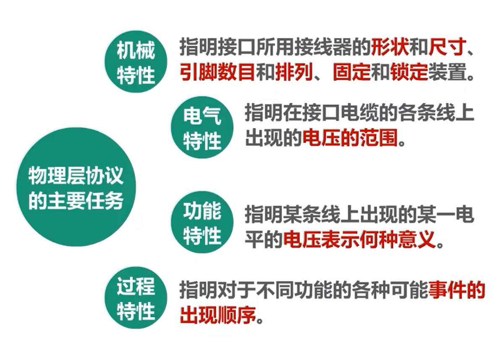
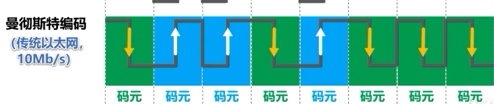

# 物理层

记录的比较简单嘻嘻。

## 基本概念

物理层就是要解决在各种传输媒体上传输比特 0 和 1 的问题，进而给链路层提供服务，使链路层只需要考虑如何完成它自己的协议和服务，而不必考虑网络的具传输媒体是什么。我们学习物理层就掌握基本概念就 ok 了。

## 物理层下的传输媒体（不属于任何层）

用来连接各种网络设备的传输媒体可分为两类：

1. 导引型传输媒体：
   1. 双绞线
   2. 同轴电缆
   3. 光纤
2. 非导引型传输媒体：
   1. 微波通信
   2. 无线电波
   3. 红外线
   4. 可见光（比如用于 LiFi）

## 常用编码

数据传输就是一堆的 0 和 1 嘛，但是我们其实不能用高电平 1，低电平 0 的方式进行传输。因为如果你连着传了 3 个 1，这三个一都是高电平，那对方怎么能知道你传递的是 3 个而不是 1 个呢？但如果你能保证双方严格同步才可以。
曼彻斯特编码：下降是 0，上升是 1。这多好啊，对方只要一查上升和下降的个数就全明白了。

