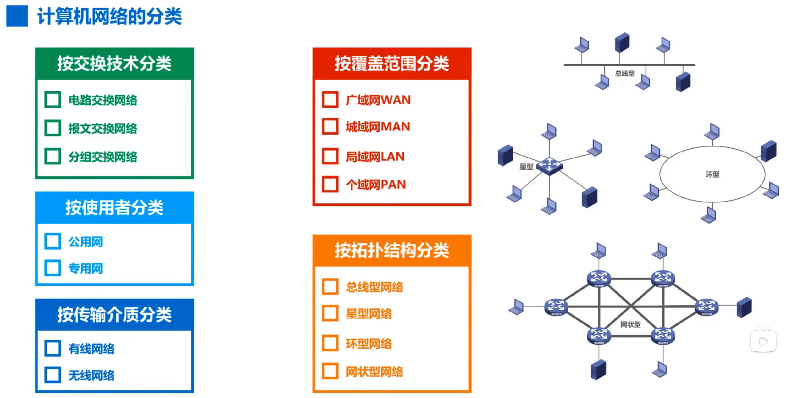

# 计算机网络体系结构

## 计算机网络的分类

## 计算机网络体系结构

OSI 7 层体系结构（法律上）、TCP/IP 4 层体系结构（事实上）

## 计算机网络分层的必要性

1. 分层主要是为了将庞大而复杂的问题，转换成若干较小的局部问题，为了更易于研究和处理。
2. 在教材中为了更好的教学给 TCP/IP 四层整成了五层。
   1. 应用层：解决通过应用进程的交互来实现特定的网络应用问题
   2. 传输层：解决进程之间基于网络的通信问题
   3. 网络层：解决分组在多个网络上传输（路由）的问题
   4. 链路层：解决分组在一个网络（或一段链路）上传输的问题
   5. 物理层：解决使用何种信号来传输比特的问题
