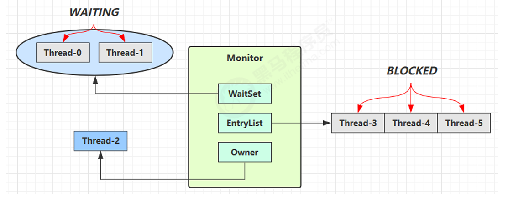
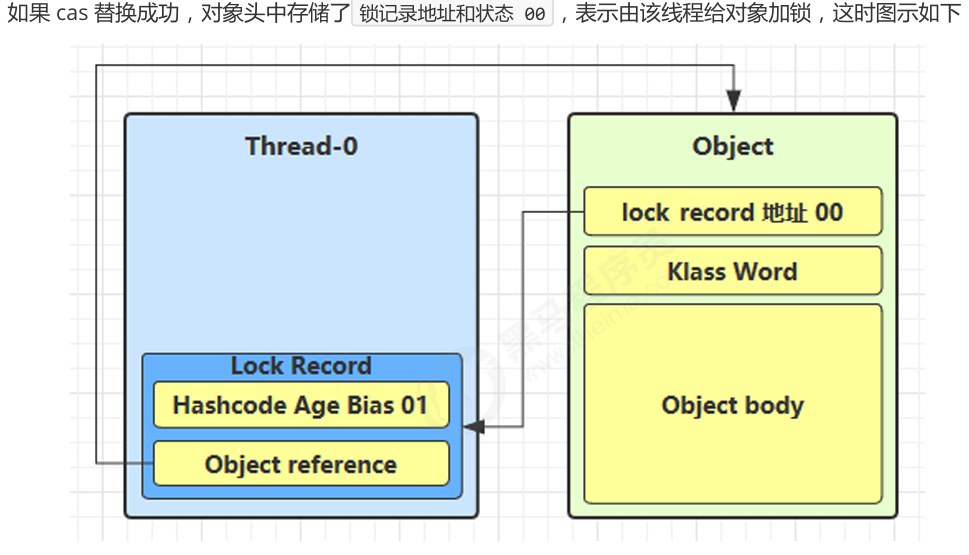
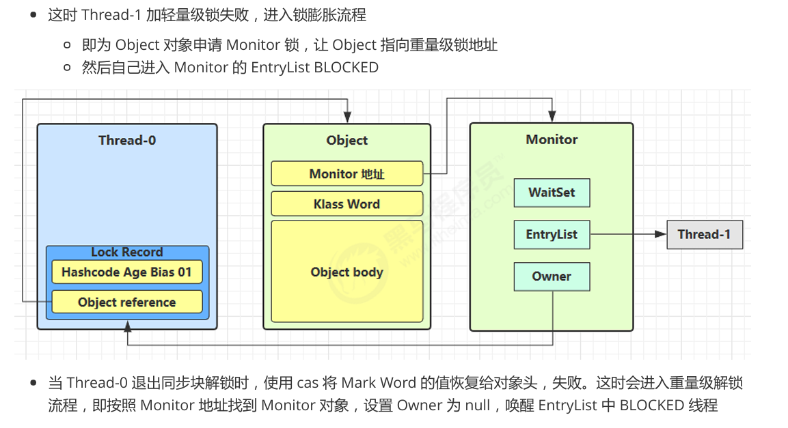

# 深挖 Synchronized 原理

写在前面：我太懒了，这里的图都是来自我学习 JUC 时候看的黑马程序员视频中的图。感谢这个教学视频，感谢讲解这个教学的老师。

## synchronized 能干啥

**简单一句话**：synchronized 关键字用于实现同步控制，确保同一时刻只有一个线程可以执行被保护的代码块或方法。

## Monitor 原理

在提起 synchronized 之前必须要和大家说一下 Monitor 对象。Monitor 被翻译成监视器，每个 Java 对象都可以关联一个 Monitor 对象，如果给一个对象加上重量级锁后，这个对象头中的 Mark Word 就被设置成指向 Monitor 对象的指针。

- WaitSet：是那些调用了 wait( )方法的线程，调用 wait( )的线程会进入进入 WAITING 状态并，主动放弃这个锁对象进入 WaitSet 中等别的线程 notify，在别的线程 notify 后会进入 EntryList 中和大家一起竞争锁资源。
- EntryList：那些没有竞争到锁只好阻塞的 loser。（可怜呜呜呜）
- Owner：锁的持有者。

## Synchronized 之偏向锁

1. 适用于只有一个线程访问同步块的场景。好不好奇为啥啊？
2. 因为 JVM 会把这个共享变量的的对象头的 MarkWord 设置成这个线程 id，之后如果还是这个线程来访问，就不用 CAS 了！嘶。。。是不是很奇怪这里我为啥要写 CAS 呢？请看轻量级锁！！！

## Synchronized 之轻量级锁

1. **适用场景**：有多个线程来竞争，但是竞争不太激烈，比如加锁的时间是错开的。
2. **如何实现呢？**
   JVM 会在当前的线程的每个栈帧中创建一个 Lock Record 对象，并尝试使用 CAS 把这个共享变量的对象头中的 Mark Word 替换为指向这个 Lock Record 的指针。同时 JVM 在轻量级锁的实现中引入了 锁计数器 和 持有线程的标识（保存在对象头的 Mark Word 里）。
   
3. **如果 CAS 失败了呢？**
   黑马课程告诉你会有两种情况：一是可能出现其他线程来竞争了，二是可能是自己锁重入。但我告诉你这不对，因为这样太傻了！为啥自己锁重入还要 CAS 啊？CAS 还得比对这那的，为啥不在 CAS 前看看 Mark Word 里持有线程标识是不是自己就好了呢？看我的第四条！
   - 有其他线程来获取锁了，发现这个共享变量对象头的 Mark Word 已经被修改了。完蛋啦完蛋啦，出现竞争啦，锁膨胀叭。
4. **锁重入**
   轻量级锁重入就是发现 Mark Word 里的线程标识就是自己，然后不去 CAS，直接把锁计数器+1。退出就-1 呗。
5. **锁释放**
   当退出 synchronized 代码块（解锁时）锁记录的值不为 null，这时使用 CAS 将 Mark Word 的值恢复给对象头。请问会失败吗？会！因为有可能出现了锁升级，这时就要进行重量级锁的解锁流程。

## Synchronized 之重量级锁

1. **适用场景**：当多个线程频繁竞争同一个对象的锁，导致轻量级锁无法有效处理时。
2. **如何实现**：终于用到了开头说的 Monitor 对象了！JVM 会将对象头的 Mark Word 指向一个名为 ObjectMonitor 的数据结构。ObjectMonitor 包含了所有与锁相关的状态信息，如持有锁的线程（Owner）、等待队列（WaitSet）、阻塞队列（EntryList）等。
3. 下面一张图我直接截来的，它的前提是 Thread-0 已经获取锁对象，是轻量级锁，这时候 Thread-1 来获取这个锁，CAS 失败了。开始进行锁膨胀。具体请看图片。
   

## 自旋优化

有没有感觉升级到重量级锁的过程太简单了，感觉锁膨胀和阻塞会很频繁吧？人家大佬肯定也知道，所以来看看这个 JVM 的 sao 操作。

1. **解释一下**：就是让线程在短时间内不断尝试通过 CAS 操作获取锁，而不立即进入阻塞状态。如果在这段时间内锁被释放，线程可以立即获得锁并继续执行，避免了阻塞和唤醒的开销。这多好啊！( CPU 说：你最好是个人？)
2. 自旋优化比较适合那些竞争不太激烈，而每个线程占用锁的时间比较短的情况。对了，自旋优化的一些参数还可以手动在启动 JVM 前配置，感兴趣的朋友可以用大语言模型搜搜。
